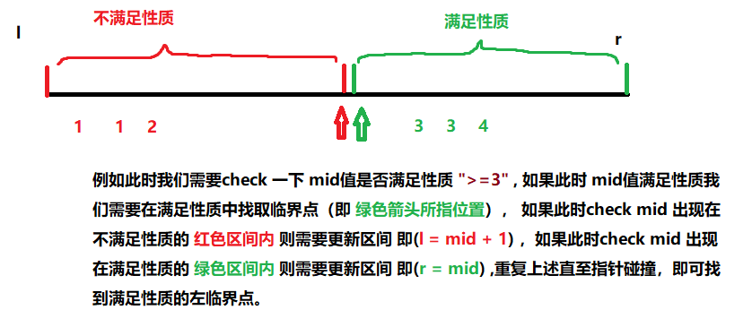

## 整数二分思想以及模板

**📝思想理解：**

- 具有`单调性的问题`，**一定可以采用二分来解决该问题**。但是`能采用二分来解决的问题`，**不一定具有单调性**。——**故二分本质并非是单调性**

- **二分的本质**：**边界中某种性质**，在`右半边区间满足条件`，`左半边区间不满足条件的这个性质`就**可以采用二分**。

  **第一个模板：用来找满足该性质的边界值**

  - **mid = l + r >> 1**
  - **if (check(mid))** 
    - `true` **[l,mid]** ----- > `r = mid`
    - `false` **[mid+1,r]** -----> `l = mid + 1`

  **第二个模板:用来找不满足性质的边界值**

  - **mid = l + r + 1>> 1**
  - **if (check(mid))** 
    - `true` **[mid,r]** ----- > `l = mid`
    - `false` **[l,mid-1]** -----> `r = mid - 1`

> [二分思想模板理解](https://www.acwing.com/solution/content/8235/)

**注意点:**

- 一般我们都是根据check函数来定义边界，如果`check 函数为true时 l = mid` 则`mid = l + r + 1 >> 1` ，如果`check 函数为true时 r = mid 则mid = l + r >> 1`
- 这里我们可以理解为如果针对于 `l = r - 1`的情况来进行考虑，因为 如果 `mid = l + r >> 1 `的话,那么**向下取整** ，`那么 l = l 就会造成死循环，这也就是为什么这里需要加1`

****
📑 典型例题：

> [AcWing 789. 数的范围](https://www.acwing.com/problem/content/791/)
>
> [Leetcode 35. 搜索插入位置](https://leetcode-cn.com/problems/search-insert-position/)
>
> [Leetcode 278. 第一个错误的版本](https://leetcode-cn.com/problems/first-bad-version/)
>
> [Leetcode 374. 猜数字大小](https://leetcode-cn.com/problems/guess-number-higher-or-lower/)