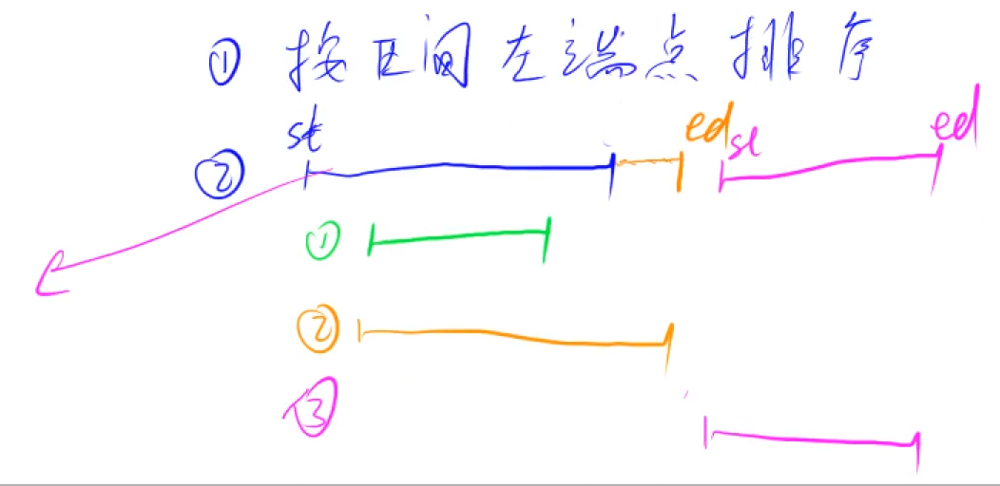

## 区间合并类型问题思想理解与例题

**📝思想理解：**

- **如遇区间合并问题无非就是解决如下两种子问题即可。**
  - 第一步：按照区间左端点进行排序,或者按照右端点排序，或者按照两端点关键字进行排序。
  - 第二步：扫描整个区间，修改左端点/右端点所处位置，如果跳脱区间，则将答案追加的同时,将当前扫描区间作为新区间扫描后续区间，重复上述操作。

 **图示理解：**



**小付的代码：**

```java
import java.io.*;
import java.util.*;
class Main{
    static int N = 100010;
    static int[][] intervals ;
    static void init(){
        intervals = new int[N][2];
    }
    public static void main(String[] args) throws IOException{
        init();
        InputStreamReader in = new InputStreamReader(System.in);
        BufferedReader br = new BufferedReader(in);
        
        int n = Integer.parseInt(br.readLine());
        for (int i = 1; i<= n;i++){
            String [] params = br.readLine().split(" ");
            int l = Integer.parseInt(params[0]);
            int r = Integer.parseInt(params[1]);
            intervals[i][0] = l;
            intervals[i][1] = r;
        }
        
        int cnt = 0 ;
        PriorityQueue<int []> pq = new PriorityQueue<>((a,b)->{
            return a[0] == b[0] ? a[1] - b[1] : a[0] - b[0];
        });
        for(int i = 1; i<= n;i++){
            pq.add(intervals[i]);
        }
        int[] interval = pq.poll();
        int st = interval[0];
        int ed = interval[1];
        while (!pq.isEmpty()){
            int [] tmp = pq.poll();
            int tmpSt = tmp[0];
            int tmpEd = tmp[1];
            if (tmpSt <= ed){
                ed = Math.max(ed, tmpEd);
            }else {
                cnt ++;
                st = tmpSt;
                ed = tmpEd;
            }
        }
        cnt ++ ;
        System.out.println(cnt);
    }
}
```

**y总模板解决：**

```java
/***
 * @author： Alascanfu
 * @date ： Created in 2022/4/6 17:22
 * @description： AcWing 区间合并的基础问题模板思想理解与解决
 * @modified By： Alascanfu
 **/
public class IntervalMergeTemplate {
    public static void main(String[] args) throws IOException {
        InputStreamReader in = new InputStreamReader(System.in);
        BufferedReader br = new BufferedReader(in);
        int n = Integer.parseInt(br.readLine());
        List<P> alls = new ArrayList<>();
        for (int i = 1; i <= n; i++) {
            String[] params = br.readLine().split(" ");
            int st = Integer.parseInt(params[0]);
            int ed = Integer.parseInt(params[1]);
            alls.add(new P(st, ed));
        }
        Collections.sort(alls);
        System.out.println(merge(alls));
    }
    
    static int merge(List<P> alls) {
        List<P> res = new ArrayList<>();
        int st = (int) -2e9;
        int ed = (int) -2e9;
        for (P p : alls) {
            if (ed < p.st) {
                if (ed != (int) -2e9) {
                    res.add(new P(st, ed));
                }
                st = p.st;
                ed = p.ed;
            } else {
                ed = Math.max(ed, p.ed);
            }
        }
        if (ed != (int) -2e9) res.add(new P(st, ed));
        return res.size();
    }
}

class P implements Comparable<P> {
    int st, ed;
    
    public P(int st, int ed) {
        this.st = st;
        this.ed = ed;
    }
    
    @Override
    public int compareTo(P p) {
        return Integer.compare(st, p.st);
    }
}
```

