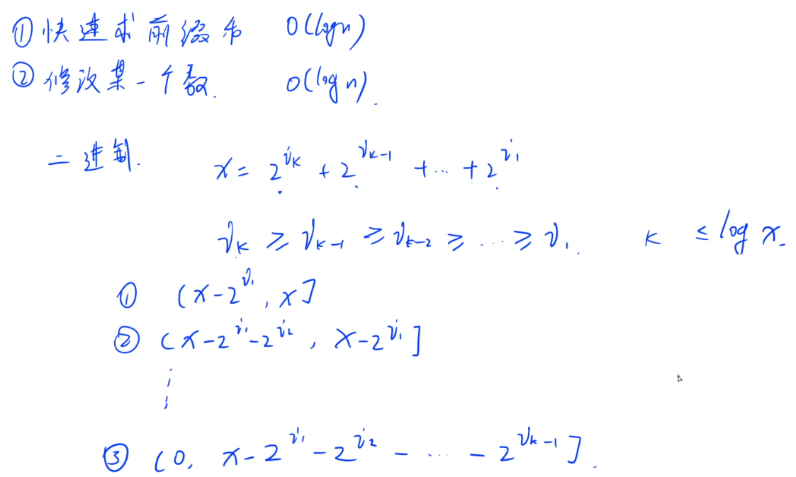
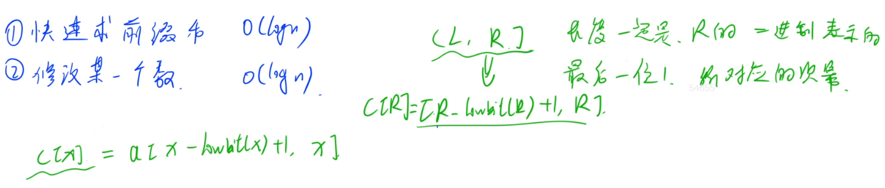
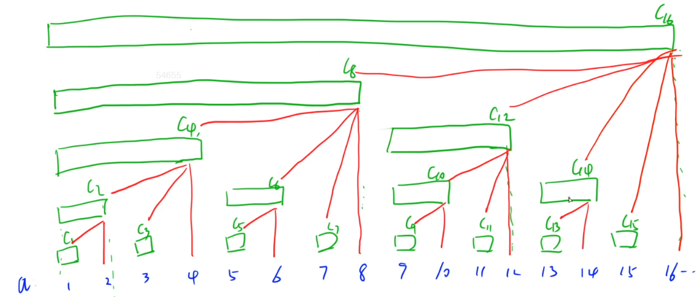
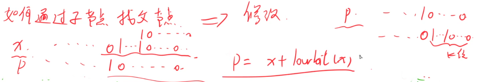
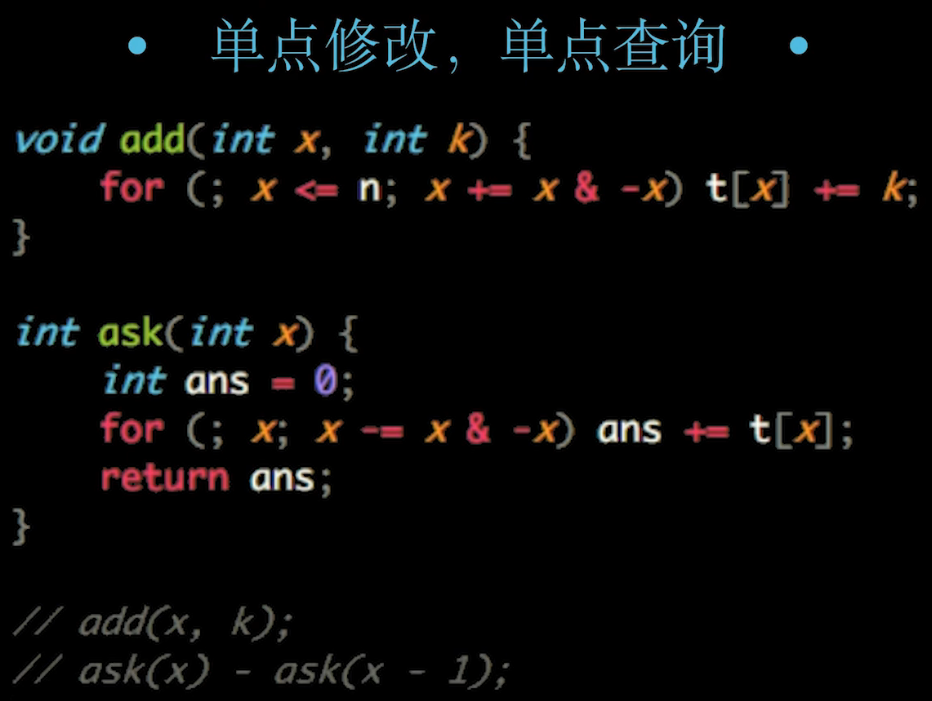
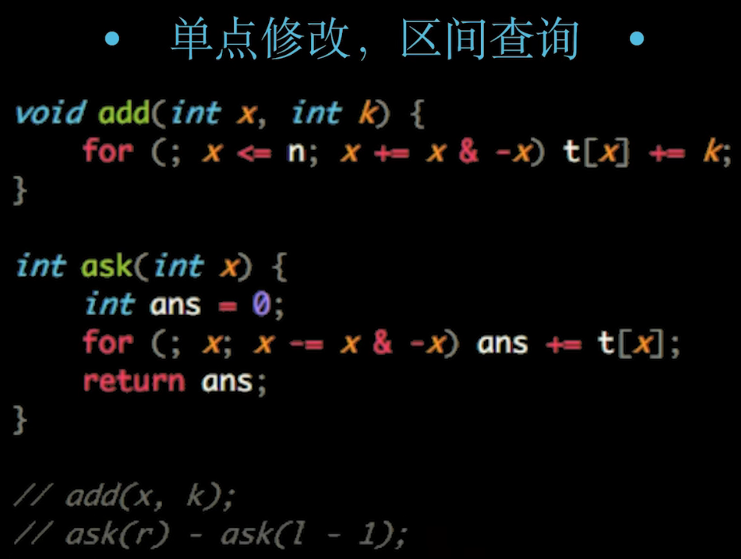
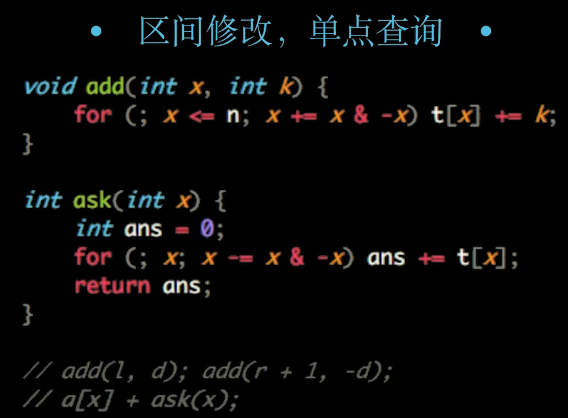
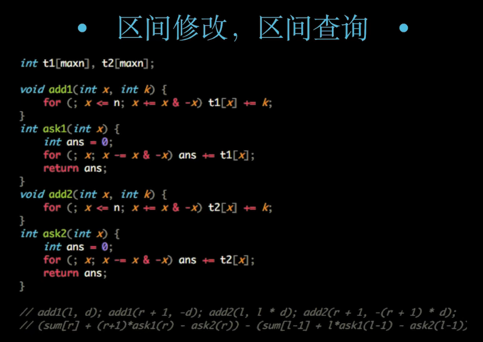

## 树形数组以及思路汇总和例题

> #### [307. 区域和检索 - 数组可修改](https://leetcode-cn.com/problems/range-sum-query-mutable/)

## **📝思想理解**

> 这里是参考 [三叶姐姐的解题思路](https://leetcode-cn.com/problems/range-sum-query-mutable/solution/guan-yu-ge-lei-qu-jian-he-wen-ti-ru-he-x-41hv/)

针对不同的题目，我们有不同的方案可以选择（假设我们有一个数组）：

- **数组不变，求区间和**：「前缀和」、「树状数组」、「线段树」
- **多次修改某个数（单点）**，求区间和：「树状数组」、「线段树」
- **多次修改某个区间**，输出最终结果：「差分」
- **多次修改某个区间，求区间和**：「线段树」、「树状数组」**（看修改区间范围大小）**
- **多次将某个区间变成同一个数，求区间和**：「线段树」、「树状数组」**（看修改区间范围大小）**

:bookmark_tabs:**解题用法选择思想：**

> 这样看来，「线段树」能解决的问题是最多的，那我们是不是无论什么情况都写「线段树」呢？

答案并不是，而且恰好相反，只有在我们遇到第 4 类问题，**不得不写「线段树」的时候**，我们**才考虑线段树**。

因为**「线段树」代码很长，而且常数很大**，实际`表现不算很好`。我们**只有在不得不用的时候才考虑「线段树」**。

总结一下，我们应该按这样的优先级进行考虑：

- **简单求区间和**，用**「前缀和」**
- **多次将某个区间变成同一个数**，用**「线段树」**
- **其他情况，用「树状数组」**

:bookmark_tabs:**数状数组模板以及使用？思想理解？**

本题显然属于第 2 类问题：**多次修改某个数，求区间和。**

我们使用**「树状数组」**进行求解。

**「树状数组」本身是一个很简单的数据结构，但是要搞懂其为什么可以这样「查询」&「更新」还是比较困难的（特别是为什么可以这样更新），往往需要从「二进制分解」进行出发理解。**

因此我这里直接提供「树状数组」的代码，大家可以直接当做模板背过即可。

**:book: lowbit**

- 树状数组基本操作 `lowbit(x)` 是`返回 x 的最后一位1及其后面0或空组成的二进制数`
- 例如 `lowbit(10)`  10 = $(1010)_2$ 从右边数第一次遇到1往右的所有的位组成的二进制数 这里 返回的就是2.

> 如何计算？

`x & -x`   ===>   `x & (~x + 1)`

```java
x  =  1010 ... 100 ... 0
~x =  0101 ... 011 ... 1
~x+1= 0101 ... 100 ... 0
```

这样一来就可以计算`lowbit(x)`了

```java
// 上来先把三个方法写出来
{
    int[] tree;
    int lowbit(int x){
        return x & -x;
    }
    // 查询前缀和的方法
    int query(int x){
        int res = 0 ;
        for (int i = x ; i > 0;i -= lowbit(i))res += tree[i];
        return res;
    }
    
    // 在树状数组 x 位置中增加值 u
    void add(int x ,int u ){
        for (int i = x ; i<= n;i+= lowbit(i))tree[i] += u;
    }
    
}
// 初始化 树状数组 ，要默认数组是从 1 开始的
{
    for (int i = 0 ;i< n;i++)add(i+1,nums[i]);
}
// 树状数组的使用 
{
    void update (int i ,int val){
        // 原有的值是 nums[i] ,要使得 修改为 val 需要增加 val - nums[i]
        add(i + 1 , val - nums[i]);
        nums[i] = val;
    }
    
    int sumRange(int l , int r ){
        return query(r + 1) - query(l);
    }
}
```

## :bookmark_tabs: **基本原理理解以及扩展**

===> 差分

===> 差分 + 公式

===> 例题

> **树状数组 能干什么？**

- **快速求解前缀和** $O(logN)$
- **单点操作修改某一个数$O(logN)$**

树状数组 是一个基于二进制的思想来实现的







> 如何通过子节点找到父节点



## :bookmark_tabs:树状数组扩展代码模板

> 树状数组扩展代码模板









## :bookmark_tabs: 总结

- **单点修改，单点查询** add(x,k); ask(x) - ask(x - 1);
- **单点修改，区间查询** add(x,k); ask(r) - ask(l - 1);
- **区间修改，单点查询** add(l,k); add(r + 1,-k); arr[x] + ask(x);
- **区间修改，区间查询** 一般这种题采用线段树比较好

```java
/***
 * @author： Alascanfu
 * @date ： Created in 2022/4/4 16:24
 * @description： 树形数组模板
 * @modified By： Alascanfu
 **/
public class TreeArray {
    int n ;
    int [] tree;
    int [] nums;
    int lowbit(int x){
        return x & -x;
    }
    
    void add(int x , int u){
        for (int i = x ; i<= n;i+=lowbit(i))tree[i]+=u;
    }
    
    int query(int x){
        int res = 0;
        for (int i = x; i > 0;i-=lowbit(i))res += tree[i];
        return res;
    }
    
    public void init(int[] nums){
        this.n = nums.length;
        this.nums = nums;
        tree = new int[n+1];
        for (int i = 0 ; i< n;i++)add(i+1,nums[i]);
    }
    
    /**
     * 功能描述
     * 单点修改
     * @date 2022/4/4
     * @author Alascanfu
     */
    void updateOneNum(int index ,int val ){
        add(index+1,val - nums[index]);
        nums[index] = val;
    }
    
    /**
     *功能描述
     * 单点查询
     * @date 2022/4/4
     *  @author Alascanfu
     */
    int queryOneNum(int index){
        return query(index + 1) - query(index);
    }
    
    /**
     * 功能描述
     * 区间查询
     * @date 2022/4/4
     * @author Alascanfu
     */
    int sumRanges(int left ,int right ){
        return query(right + 1) - query(left);
    }
    
    /**
     *功能描述
     * 区间修改
     * @date 2022/4/4
     *  @author Alascanfu
     */
    void updateIntervalChanges(int left ,int right ,int val){
        add(left+1,val);
        add(right+1 ,-val);
    }
}
```

