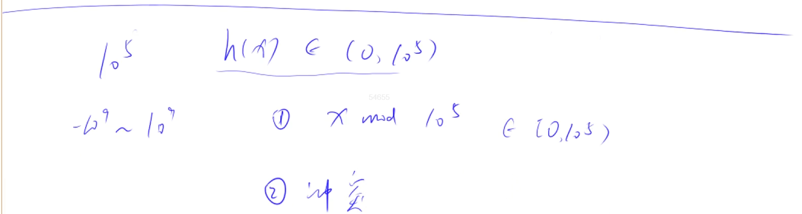
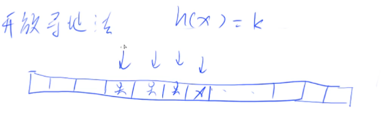
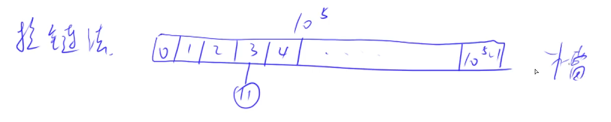
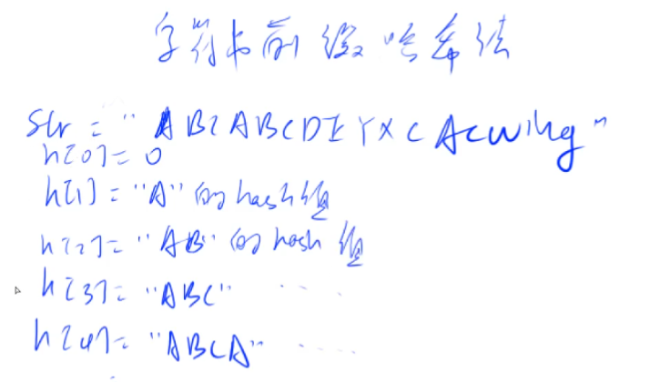
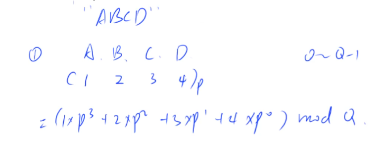
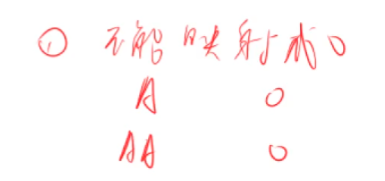
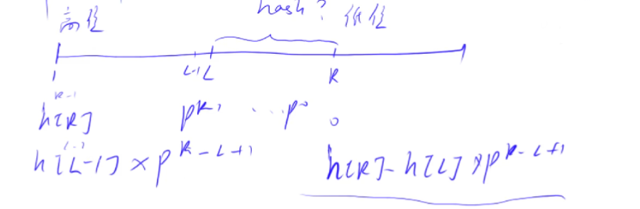

# :book: 哈希表以及字符串哈希方法理解与实现



## :bookmark_tabs: 哈希表存储结构

### :bookmark: 开放寻址法 （常用）

> **只需要开一个 题目给定数据范围的 2 ~ 3倍 的数组来进行存储映射**
>
> **如何处理冲突？**

如果出现冲突则按顺序找到数组中第一个未冲突位置进行存储



**Y总模板实现**

```java
import java.io.*;
import java.util.*;

class Main{
    static int N = 200003;
    static int NULL = 0x3f3f3f;
    static int[] h;
    static int idx ;
    
    static void init(){
        h = new int[N];
        Arrays.fill(h,0x3f3f3f);
    }
    
    static int find(int x){
        int k = (x % N + N ) % N;
        while (h[k] != 0x3f3f3f && h[k] != x){
            k++;
            if (k == N )k = 0;
        }
        return k;
    }
    
    public static void main(String[] args )throws IOException{
        init();
        InputStreamReader in = new InputStreamReader(System.in);
        BufferedReader br = new BufferedReader(in);
        int n = Integer.parseInt(br.readLine());
        while (n -- > 0){
            String[] params = br.readLine().split(" ");
            String op = params[0];
            if (op.equals("I")){
                int x = Integer.parseInt(params[1]);
                h[find(x)] = x;
            }else {
                int x = Integer.parseInt(params[1]);
                System.out.println(h[find(x)] == x ? "Yes" : "No");
            }
        }
        
    }
}
```

### :bookmark: 拉链法（常用）

> **需要开一个 $10^5$ 的数组来进行存储映射作为槽 h[N]**
>
> **同时也需要开一个链表所用的数据结构空间 即 e[N] , ne[N]**

> **如何来处理冲突？**

h(11) = 3 每一个位置可以当做一个槽 将其拉下来 构建一个数为 11



**哈希表是一个期望算法——每一个拉链都可以看成常数长度——一般情况下时间复杂度可以看做为 O(1)**

> **需要完成的操作**
>
> 添加一个数
>
> 查询一个数

> 找 > $10^5$ 的第一个质数

```java
	for (int i = 100000 ; ; i++){
            boolean flag = true ;
            for (int j = 2 ; j * j <= i ; j++){
                if (i % j == 0){
                    flag = false;
                    break;
                }
            }
            if (flag){
                System.out.print(i);
                break;
            }
        }
```

**Y总模板实现**

[840. 模拟散列表 - AcWing题库](https://www.acwing.com/problem/content/842/)

```java
import java.io.*;
import java.util.*;

class Main{
    static int N = 100003;
    static int[] h,e,ne;
    static int idx ;
    
    static void init(){
        h = new int[N];
        e = new int[N];
        ne = new int[N];
        idx = 0;
        Arrays.fill(h,-1);
    }
    
    static void add(int x){
        int k = (x % N + N) % N;
        e[idx] = x;
        ne[idx] = h[k];
        h[k] = idx++;
    }
    
    static boolean contains(int x){
        int k = (x % N + N ) % N;
        for (int i = h[k] ; i != -1 ;i = ne[i]){
            if (x == e[i]){
                return true;
            }
        }
        return false;
    }
    
    public static void main(String[] args )throws IOException{
        init();
        InputStreamReader in = new InputStreamReader(System.in);
        BufferedReader br = new BufferedReader(in);
        int n = Integer.parseInt(br.readLine());
        while (n -- > 0){
            String[] params = br.readLine().split(" ");
            String op = params[0];
            if (op.equals("I")){
                int x = Integer.parseInt(params[1]);
                add(x);
            }else {
                int x = Integer.parseInt(params[1]);
                System.out.println(contains(x) == true ? "Yes" : "No");
            }
        }
        
    }
}
```

## :bookmark_tabs: 字符串哈希方式

### :bookmark: 字符串前缀哈希法





**首先需要把 字符串看做为一个 P 进制的数 ，将 P 进制的数 转化为 十进制的数，最后 对一个较小的数 Q 取模**

```txt
思路：
用前缀和的思想，求出前缀字符串的哈希值
举例说明：

"ABCDEFGHI"
 123456789   (下标)
     L   R
字符串"A"的    哈希值为 p^0+A
字符串"AB"     哈希值为 p^1+A + p^0+B
字符串"ABC"    哈希值为 p^2+A + p^1+B + C
字符串[1,L-1]的哈希值为 p^3+A + p^2+B + p^1+C + p^0+D
字符串[1,R]  的哈希值为 p^8+A + p^7+B +  ...  + P^0+I     
```

**:books:值得注意的是：**



> **经验值总结**

**假定**

**P = 131 或 13331**

**Q = $2^{64}$ 时 99.99%不会发生冲突**



> **那么如何求[L,R]字符串的哈希值呢，根据前缀和的思想，就是h[R] - h[L-1] (h[R]表示从[1,R]的字符串哈希值)？**

但是发现`h[R]`从`[1,L-1]`这一段`left`，每个数都比`right`这一段多乘了 $p^{R-(L-1)}$

所以字符串从`[L,R]`的哈希值为

$h[R] - h[L - 1] * p^{R-(L-1)} = h[R] - h[L - 1] * p^{R-L+1} $

**📖 Y总代码实现：**

```java
import java.io.*;
import java.util.*;

class Main{
    static int P = 131;
    static int N = 100010;
    static char[]str ;
    static long[] h , p;
    
    static void init(){
        str = new char[N];
        h = new long[N];
        p = new long[N];
        p[0] = 1;
    }
    
    static boolean checkIsEquals(int l1 , int r1 , int l2 ,int r2 ){
        return h[r1] - h[l1-1] * p[r1 - l1 + 1] == h[r2] - h[l2-1] * p[r2 - l2 + 1];
    }
    
    public static void main(String[] args )throws IOException{
        init();
        InputStreamReader in = new InputStreamReader(System.in);
        BufferedReader br = new BufferedReader(in);
        String[] params = br.readLine().split(" ");
        int n = Integer.parseInt(params[0]);
        int m = Integer.parseInt(params[1]);
        String s = br.readLine();
        for (int i = 1 ; i <= s.length();i++){
            str[i] = s.charAt(i-1);
        }
        
        for (int i = 1 ; i<= n ; i++){
            p[i] = p[i-1] * P;
            h[i] = h[i-1] *P + str[i];
        }
        
        while (m -- >0 ){
            params = br.readLine().split(" ");
            int l1 = Integer.parseInt(params[0]);int r1 = Integer.parseInt(params[1]);
            int l2 = Integer.parseInt(params[2]);int r2 = Integer.parseInt(params[3]);
            System.out.println(checkIsEquals(l1,r1,l2,r2) == true ? "Yes" : "No");
        }
    }
}
```

