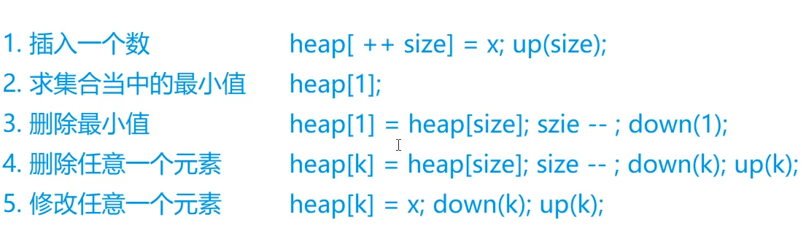
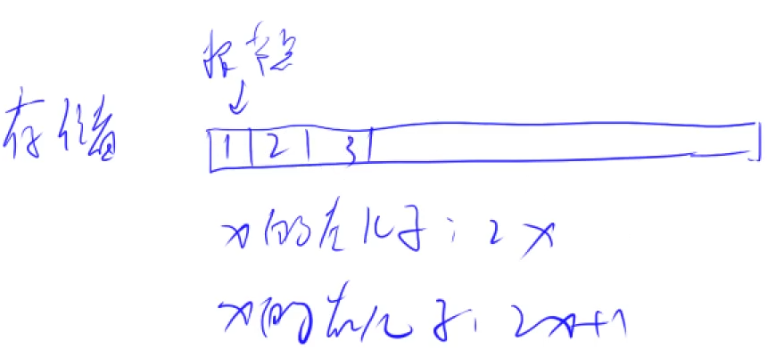
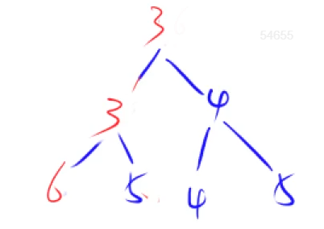
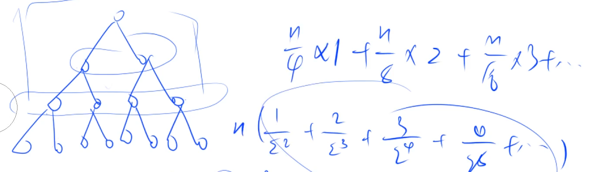
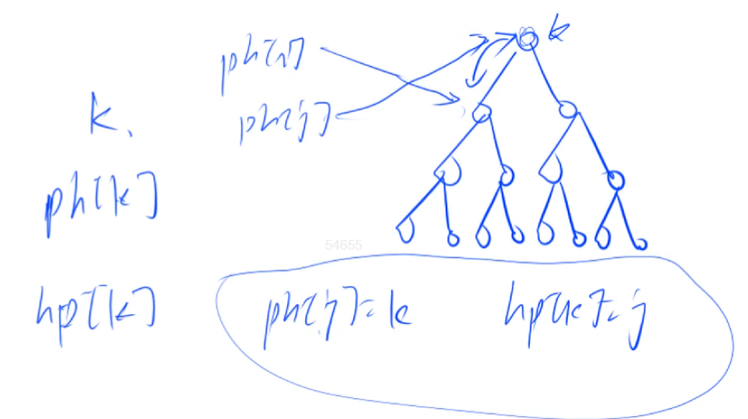

# 📖 堆的理解与相关思路实现

## :bookmark_tabs: 如何手撕一个堆？

> **堆支持的数据操作**

- **插入一个数**
- **求这个集合中的最小值**
- **删除最小值**
- **删除任意一个元素**
- **修改任意一个元素**



## :bookmark_tabs: 堆的结构

**堆可以看做是一棵完全二叉树**

>  **以小根堆为例**

**每一个点都是小于等于左右儿子节点的**

:books: **注意：由此就可以得出根节点就是当前堆的最小值**

## :bookmark_tabs: 堆的存储

**一种全新的存储方式 —— 利用一个一维数组进行存储**



一号节点是根节点——

- X 的`左儿子`为 `2X`
- X 的`右儿子`为 `2X + 1`



**down(x) 与 up(x) 操作**

### :bookmark: 操作实现

- `heap[]` 代表堆
- `size` 代表堆的大小

> **插入一个数**

```txt
heap[++size] = x;
up(size); // 上移操作
```

> **获取堆中的最小值**

```txt
heap[1] // 返回最小值
```

> **删除操作 --> 实际上是将heap 的`最后一个元素 把第一个元素覆盖`掉 然后 `size --` 再进行一次 `down(1)` 操作即可**

```txt
heap[1] = heap[size--];
down(1);
```

> **删除任意一个元素 同理**

```txt
heap[k] = heap[size--];
down(k); up(k);
```

> **修改任意一个元素**

```txt
heap[k] = x ;
down(k);
up(k);
```

> **down(int u )**

```txt
static void down(int u ){
    int t = u ;
    if ( u * 2 <= size && h[u * 2] < h[t])t = u * 2;
    if (u * 2 + 1 <= size && h[u * 2 + 1] < h[t]) t = u * 2 + 1;
    if (u != t){
        int tmp = h[t];
        h[t] = h[u];
        h[u] = tmp;
        down(t);
    }
}
```


### :bookmark: 建堆 O(n) 思路理解



## :bookmark_tabs: 堆排序

[838. 堆排序 - AcWing题库](https://www.acwing.com/problem/content/840/)

```java
import java.io.*;
import java.util.*;
class Main{
    static int N = 100010;
    static int[] h ;
    static int size ;
    
    static void init(){
        h = new int[N];
        size = 0 ;
    }
    
    static void down(int u ){
        int t = u ;
        if ( u * 2 <= size && h[u * 2] < h[t])t = u * 2;
        if (u * 2 + 1 <= size && h[u * 2 + 1] < h[t]) t = u * 2 + 1;
        if (u != t){
            int tmp = h[t];
            h[t] = h[u];
            h[u] = tmp;
            down(t);
        }
    }
    
    public static void main(String[] args )throws IOException{
        init();
        InputStreamReader in = new InputStreamReader(System.in);
        BufferedReader br = new BufferedReader(in);
        String[] params = br.readLine().split(" ");
        int n = Integer.parseInt(params[0]);
        int m = Integer.parseInt(params[1]);
        params = br.readLine().split(" ");
        for (int i = 1; i <= n; i++){
            h[i] = Integer.parseInt(params[i-1]);
        }
        size = n;
        
        for (int i = n / 2 ; i>0;i--){
            down(i);
        }
        while (m -- > 0){
            System.out.print(h[1] + " ");
            h[1] = h[size--];
            down(1);
        }
    }
}
```

## :bookmark_tabs: 堆的构建（支持上述五种操作）



[839. 模拟堆 - AcWing题库](https://www.acwing.com/problem/content/841/)

> **难点在于删除与修改操作时**

**这里的 k 代表的是第 k 个插入的数值**，需要**利用 两个数组来进行维护快速找到第 k 个插入的元素是什么** ，其中：

- `ph[k]` 代表的是 第 k 个插入元素在堆中的下标是多少 
- `hp[k]` 代表的是 该下标为 k 的点是第几个插入的点

> **说白了难点在于 heap_swap(int u1 , int u2)**

```java
static void heap_swap(int u1 , int u2){
    // 元素所在堆位置的下标进行交换
    swap(ph,hp[u1] , hp[u2]);
    // 插入的第几个点值 进行交换
    swap(hp,u1,u2);
    // 值交换
    swap(h,u1,u2);
}
    
static void swap(int[] n,int a , int b ){
    int c = n[a] ;
    n[a] = n[b] ;
    n[b] = c;
}
```

> **insert(int x)**

```java
static void insert(int x){
    h[++size] = x;
    ph[++m] = size;
    hp[size] = m;
    up(size);
}
```

> **getMin() **

```java
static int getMin(){
    return h[1];
}
```

> **deleMin() And delete(int k )**

```java
static void deleteMin(){
    heap_swap(1,size);
    size--;
    down(1);
}
    
static void delete(int k){
    k = ph[k];
    heap_swap(k,size);
    size--;
    down(k);
    up(k);
}
```

> **modify(int k , int x)**

```java
static void modify(int k ,int x){
   h[ph[k]] = x;
   down(ph[k]);
   up(ph[k]);
}
```

> **down(int u ) And up(int u)**

```java
static void down(int u ){
    int t = u;
    if (2 * u <= size && h[t] > h[2 * u])t = 2 * u;
    if (2 * u + 1 <= size && h[t] > h[2 * u + 1]) t =2 * u + 1;
    if (t != u){
        heap_swap(t,u);
        down(t);
    }
}
    
static void up(int u){
    if (u / 2 > 0 && h[u / 2] > h[u]){
        heap_swap(u/2 ,u);
        up(u/2);
    }
}
```

> **总结**

```java
import java.io.BufferedReader;
import java.io.IOException;
import java.io.InputStreamReader;

/***
 * @author： Alascanfu
 * @date ： Created in 2022/5/10 19:04
 * @description： Heap Structure
 * @modified By： Alascanfu
 **/
class Main {
    static int N = 100010;
    // h[]代表堆空间
    // ph[k]代表第 k 个插入的元素所处堆中的位置下标
    // hp[k] 代表的是堆中下标为 k 的元素是第几个插入堆中的
    static int[] h ,ph , hp;
    
    // size 代表的堆的大小
    // m 代表的是当前插入的是第几个元素
    static int size , m;
    
    // init
    static void init(){
        h = new int[N];
        ph = new int[N];
        hp = new int[N];
        size = 0 ;
        m = 0;
    }
    
    static void insert(int x){
        h[++size] = x;
        ph[++m] = size;
        hp[size] = m;
        up(size);
    }
    
    static int getCnt(){
        return h[1];
    }
    
    static void deleteMin(){
        heap_swap(1,size);
        size--;
        down(1);
    }
    
    static void delete(int k ){
        k = ph[k];
        heap_swap(k,size);
        size--;
        up(k);down(k);
    }
    
    static void modify(int k , int x){
        h[ph[k]] = x;
        up(ph[k]);down(ph[k]);
    }
    
    // heap_swap
    static void heap_swap(int u1 , int u2){
        // 交换因值改变的 位置指针 以及 插入时指针
        swap(ph,hp[u1],hp[u2]);
        swap(hp,u1,u2);
        // 堆位置下标为 u1 和 u2 的值进行交换
        swap(h,u1,u2);
    }
    
    static void swap(int[]arr , int a , int b){
        int tmp = arr[a];
        arr[a] = arr[b];
        arr[b] = tmp;
    }
    
    static void down(int u){
        int t = u ;
        if (2 * u <= size && h[t] > h[2 * u]){
            t = 2 * u;
        }
        if (2 * u + 1 <= size && h[t] > h[2 * u + 1]){
            t = 2 * u + 1;
        }
        if (t != u){
            heap_swap(u , t);
            down(t);
        }
    }
    
    static void up(int u ){
        int t = u ;
        if (u / 2 > 0 && h[u/2] > h[t]){
            heap_swap(u/2 ,t);
            up(u/2);
        }
    }
    
    public static void main(String[] args) throws IOException {
        init();
        InputStreamReader in = new InputStreamReader(System.in);
        BufferedReader br = new BufferedReader(in);
        int n = Integer.parseInt(br.readLine());
        while (n -- > 0){
            String[] params = br.readLine().split(" ");
            String operate = params[0];
            if (operate.equals("I")){
                int x = Integer.parseInt(params[1]);
                insert(x);
            }else if (operate.equals("PM")){
                System.out.println(getCnt());
            }else if (operate.equals("DM")){
                deleteMin();
            }else if (operate.equals("D")){
                int k = Integer.parseInt(params[1]);
                delete(k);
            }else if (operate.equals("C")){
                int k = Integer.parseInt(params[1]);
                int x = Integer.parseInt(params[2]);
                modify(k,x);
            }
        }
    }
}

```

