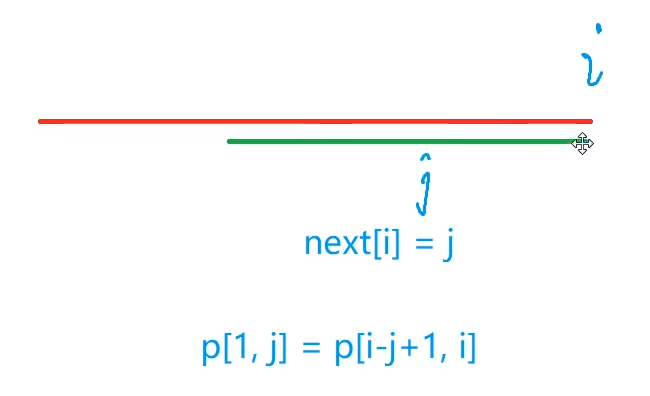
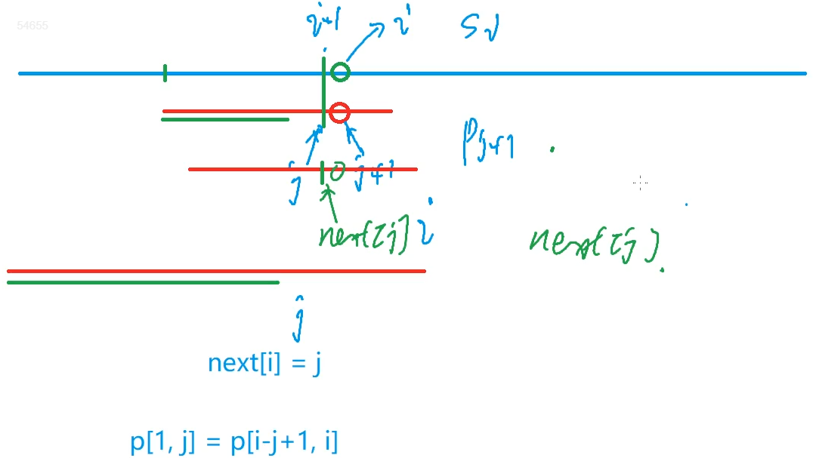
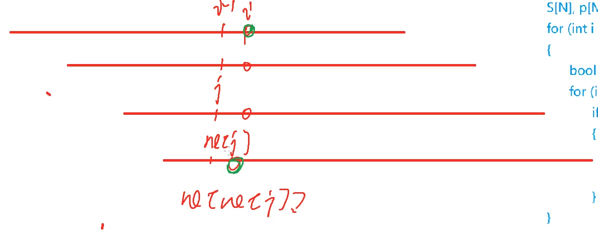

# :book: KMP算法思路理解与例题

## :bookmark_tabs: 朴素解法

```txt
S[N] 长串 , p[M] 匹配串

for (int i = 1 ; i <= n;i++){
	boolean flag = true;
	for (int j = 1 ; j<= m ;j++){
		if (s[i] != p[j]){
			flag = false;
			break;
		}
	}
}
```

## :bookmark_tabs: 如何去优化


- **由上图我们可以知道：优化的的与匹配串有关，所以如果我们能针对匹配串的每一个点预处理出来，在某个点时，前缀与后缀相等，且相等的最大长度为多少。**（难点 next[i] 含义：以 i 点为终点的后缀 与 从 1 开始的前缀 ，且后缀的长度最长）





> **📖 求 next[] 的过程**



如果无法匹配 `j = ne[j]` 

- 如果此时可以匹配了则 `j++`
- 反之 `j = ne[ne[j]]`

:bookmark_tabs: **Y总模板：**

```java
class Main{
    public static void main(String[] args )throws IOException{
        //求解 ne 数组
        for(int i = 2 , j = 0 ; i <= n ;i++){
            while(j > 0 && P[i] != P[j+1])j = ne[j];
            if (P[i] == P[j+1])j++;
            ne[i] = j;
        }
        
        //原串 匹配 匹配串
        for (int i = 1 , j = 0 ; i <= m ;i++){
            while (j > 0 && S[i] != P[j+1])j = ne[j];
            if (S[i] == P[j+1])j++;
            if (j == n){
                j = ne[j];
                // 匹配成功后的逻辑
                bw.write(i - n +" ");
            }
        }
    }
}
```

[831. KMP字符串 - AcWing题库](https://www.acwing.com/problem/content/833/)

```java
import java.io.*;
import java.util.*;

class Main{
    static int N = 100010, M = 1000010;
    static char[] S ,P;
    static int[] ne;
    static void init(){
        S = new char[M];
        P = new char[N];
        ne = new int[N];
    }
    
    public static void main(String[] args )throws IOException{
        init();
        InputStreamReader in = new InputStreamReader(System.in);
        BufferedReader br = new BufferedReader(in);
        BufferedWriter bw = new BufferedWriter(new OutputStreamWriter(System.out));
        int n = Integer.parseInt(br.readLine());
        String p =  " " + br.readLine();
        int m = Integer.parseInt(br.readLine());
        String s = " " + br.readLine();
        
        for (int i = 1;i<= m;i++)S[i] = s.charAt(i);
        for (int i = 1;i<= n;i++)P[i] = p.charAt(i);
        
        //求解 ne 数组
        for(int i = 2 , j = 0 ; i <= n ;i++){
            while(j > 0 && P[i] != P[j+1])j = ne[j];
            if (P[i] == P[j+1])j++;
            ne[i] = j;
        }
        
        //原串 匹配 匹配串
        for (int i = 1 , j = 0 ; i <= m ;i++){
            while (j > 0 && S[i] != P[j+1])j = ne[j];
            if (S[i] == P[j+1])j++;
            if (j == n){
                j = ne[j];
                bw.write(i - n +" ");
            }
        }
        bw.flush();
    }

}
```

