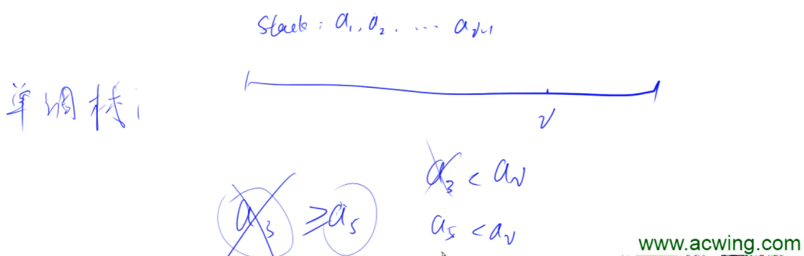

# :book: 单调栈的模板思路以及例题

## :bookmark_tabs: 单调栈常见解题模型

- **单调栈常用于解决给定好的一个序列中的每一个数，离它 左边 / 右边 最近且最大 / 最小 的数**



> **关系推理**

- **如果单调栈中 存在 $a_x \ge a_y$ 且 $x < y$ 那么 $a_x$ 就可以被删掉** ，我们可以维护一个具有单调性的元素栈，可以递增 / 递减 需要注意的是如果遇到不能维持单调性的元素就不将其加入元素栈中。

**:bookmark_tabs:Y总模板：**

```java
import java.io.*;
import java.util.*;

class Main{
    static int N = 100010;
    static int [] stk;
    static int top ;
    
    
    static void init(){
        stk = new int[N];
        top = 0;
    }
    
   	public static void Template(int[] nums){
        for (int i = 0 ; i < n;i++){
            while (top > 0 && stk[top] >= nums[i])top--;
            if (top > 0){
                System.out.print(stk[top] + " ");
            }else {
                System.out.print("-1 ");
            }
            stk[++top] =  nums[i];
        }
    }
}
```

> [830. 单调栈 - AcWing题库](https://www.acwing.com/problem/content/832/)

```java
import java.io.*;
import java.util.*;

class Main{
    static int N = 100010;
    static int [] stk;
    static int top ;
    
    
    static void init(){
        stk = new int[N];
        top = 0;
    }
    
    public static void main(String[] args )throws IOException{
        init();
        InputStreamReader in = new InputStreamReader(System.in);
        BufferedReader br = new BufferedReader(in);
        
        int n = Integer.parseInt(br.readLine());
        String[] params = br.readLine().split(" ");
        int[] nums = new int[n];
        for (int i = 0 ; i< n ;i++){
            nums[i] = Integer.parseInt(params[i]);
        }
        
        for (int i = 0 ; i < n;i++){
            while (top > 0 && stk[top] >= nums[i])top--;
            if (top > 0){
                System.out.print(stk[top] + " ");
            }else {
                System.out.print("-1 ");
            }
            stk[++top] =  nums[i];
        }
    }
}
```

**:bookmark_tabs: 直接用util包下的stack**

```java
import java.io.*;
import java.util.*;
class Main{
    
    static void init(){
    
    }
    
    public static void main(String[] args)throws IOException{
        InputStreamReader in = new InputStreamReader(System.in);
        BufferedReader br = new BufferedReader(in);
        init();
        Stack<Integer> stack = new Stack<>();
        int n = Integer.parseInt(br.readLine());
        int[] nums = new int[n];
        String[] params = br.readLine().split(" ");
        for (int i = 0 ; i < n ; i++){
            nums[i] = Integer.parseInt(params[i]);
        }
        
        for (int i = 0 ; i< n ; i++) {
            while (!stack.isEmpty() && nums[i] <= stack.peek()) {
                stack.pop();
            }
            if (!stack.isEmpty()) System.out.print(stack.peek()+ " ");
            else System.out.print("-1 ");
            stack.add(nums[i]);
        }
    }
}
```

> **典型例题**

#### [739. 每日温度](https://leetcode-cn.com/problems/daily-temperatures/)

#### [503. 下一个更大元素 II](https://leetcode-cn.com/problems/next-greater-element-ii/)

#### [1673. 找出最具竞争力的子序列](https://leetcode-cn.com/problems/find-the-most-competitive-subsequence/)

:bookmark_tabs: **需要记录下标位置的模板**

[503. 下一个更大元素 II](https://leetcode-cn.com/problems/next-greater-element-ii/)

```java
class Solution {
    public int[] Template(int[] nums) {
        int n = nums.length;
        int[] res =  new int [n];
        Arrays.fill(res,-1);
        Stack<Integer> stack = new Stack<>();
        for (int i = 0 ; i < 2 * n ; i++){
            while (!stack.isEmpty() && nums[stack.peek()] < nums[i % n]){
                res[stack.pop()] = nums[i % n ];
            }
            stack.add(i % n );
        }
        return res;
    }
}
```

[739. 每日温度](https://leetcode-cn.com/problems/daily-temperatures/)

```java
class Solution {
    public int[] dailyTemperatures(int[] temperatures) {
        Stack<Integer> stack = new Stack<>();
        int n = temperatures.length;
        int[] res = new int[n];
        for (int i = 0 ; i < n;i++){
            while (!stack.isEmpty() && temperatures[i] > temperatures[stack.peek()]){
                int preIdx = stack.pop();
                res[preIdx] = i- preIdx;
            }
            stack.add(i);
        }
        return res;
    }
}
```

