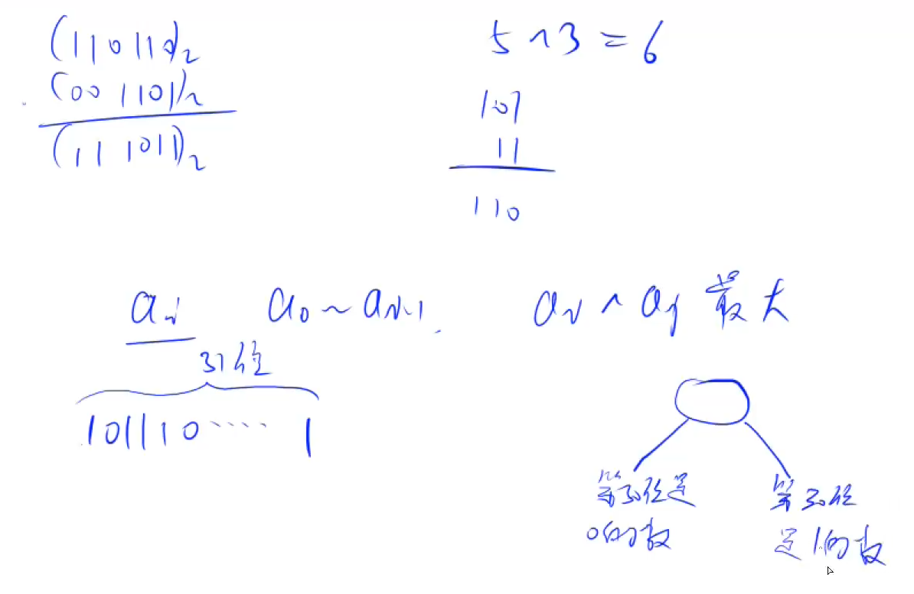

# :bookmark: 实现Trie（前缀树）

> 题目：[《Leetcode —— 208. 实现Trie 前缀树》](https://leetcode-cn.com/problems/implement-trie-prefix-tree/)
>
> > 总结自 三叶姐姐的题解：[【设计数据结构】实现 Trie (前缀树) ](https://mp.weixin.qq.com/s?__biz=MzU4NDE3MTEyMA==&mid=2247488490&idx=1&sn=db2998cb0e5f08684ee1b6009b974089&chksm=fd9cb8f5caeb31e3f7f67dba981d8d01a24e26c93ead5491edb521c988adc0798d8acb6f9e9d&token=1006889101&lang=zh_CN&scene=21#wechat_redirect)
>
> > 同时学习了Y总的模板进行归纳总结

> 什么是Trie？有什么作用？

Trie（发音类似 "try"）或者说 `前缀树` 是一种`树形数据结构`，用于`高效地存储和检索字符串数据集中的键`。这一数据结构有相当多的应用情景，例如**自动补完和拼写检查**。

> Trie需要实现些什么功能？

- `Trie() `初始化前缀树对象。
- `void insert(String word)` 向前缀树中插入字符串 word 。
- `boolean search(String word) `如果字符串 word 在前缀树中，返回 true（即，**在检索之前已经插入**）；否则，返回 false 。
- `boolean startsWith(String prefix)` 如果**之前已经插入的字符串 word 的前缀之一为 prefix** ，返回 true ；否则，返回 false 。

> 实现结构示例

```txt
输入
["Trie", "insert", "search", "search", "startsWith", "insert", "search"]
[[], ["apple"], ["apple"], ["app"], ["app"], ["app"], ["app"]]

输出
[null, null, true, false, true, null, true]

解释
Trie trie = new Trie();
trie.insert("apple");
trie.search("apple");   // 返回 True
trie.search("app");     // 返回 False
trie.startsWith("app"); // 返回 True
trie.insert("app");
trie.search("app");     // 返回 True
```

> Trie 树简介

$Trie$ 树（又叫`「前缀树」`或`「字典树」`）是一种用于快速查询**「某个字符串/字符前缀」**是否存在的数据结构。

其核心是`使用「边」来代表有无字符`，使用`「点」来记录是否为「单词结尾」`以及`「其后续字符串的字符是什么」`。

**用于高效存储和查找字符串集合的数据结构**

 

## 实现方式一：二维数组

一个朴素的想法是直接使用「二维数组」来实现 $Trie$ 树。

- 使用二维数组$trie[p][u]$  来表示当前 $p$ 这个节点有没有 $u$ 这个儿子。
- 使用 $index$ 来自增记录我们到底用了多少个格子（`相当于给被用到格子进行编号`）。  $index$ 的下标是0的点，**既是根节点 ，又是空节点。**
- 使用 $count[]$ 数组记录**某个格子被「被标记为结尾的次数」**（当 编号的格子被标记了$n$  次，则有 $cnt[index] = n$ ）。

> 步骤一：初始化数组结构用于存储单词字符

```java
class Trie{
    /** 初始化所需大小*/
    int N = 100010;
    int[][] trie;
    /** 用于记录idx格子被标记为结尾的次数*/
    int[] count ;
    /** 格子编号*/
    int idx ;
    
    public Trie(){
        trie = new int[N][26];
        count = new int[N];
        idx = 0;
    }
}
```

> 步骤二：实现向前缀树中插入字符串

```java
	public void insert(String s){
        int p = 0;
        for (int i = 0 ; i< s.length();i++){
            int u = s.charAt(i) - 'a';
            if (trie[p][u] == 0)trie[p][u] = ++idx;
            p = trie[p][u];
        }
        count[p]++;
    }
```

**解释一下：我们插入当前的字符串对逐个字符从根节点之后进行添加，p 代表当前节点，u代表下一个需要插入的字符节点。**

- `if (trie[p][u] == 0)trie[p][u] = ++idx;`

*上述语句表示，当前节点 `p下是否有 u这个儿子节点`，如果这个节点不存在，就给他插入并且对其节点进行编号。*

**然后此时树无论如何都会往下面走**，即`p = trie[p][u];`

当所有字符插入树中之后，**此时的p节点位置就是当前构成字符串的最后一个字符位置**，`做上标记，作为到达此标记时就会有一个字符串在树中是存在的`。

> 步骤3：实现从前缀树中查询当前字符串是否存在于前缀树中

```java
	public boolean search(String s){
        int p = 0;
        for (int i = 0 ; i< s.length();i++){
            int u = s.charAt(i) - 'a';
            if (trie[p][u] == 0)return false;
            p = trie[p][u];
        }
        return cnt[p] > 0;
    }
```

**解释当前如果查询的下一个字符不能在当前已查询的树中找到下一个字符节点，则说明当前字符并不存在。**

**同时就算如果遍历到当前字符，如果这个字符不是字符串的结尾字符也就不会构成字符串在所需查询的字典树中存在。所以需要判断。**

> 步骤4：实现从前缀树中查询当前前缀为已存在的字符串的前缀

```java
	public boolean startsWith(String prefix){
        int p = 0;
        for (int i = 0 ; i< prefix.length();i++){
            int u = prefix.charAt(i) - 'a';
            if (trie[p][u] == 0)return false;
            p = trie[p][u];
        }
        return true;
    }
```

**简单的理解，这里不再赘述。**

> 最后一步就是整合形成前缀树的模板

```java
class Trie{
    int N = 100010;
    int[][] trie;
    int[] count ;
    int idx ;
    
    public Trie(){
        trie = new int[N][26];
        count = new int[N];
        idx = 0;
    }
    
    public void insert(String s){
        int p = 0;
        for (int i = 0 ; i< s.length();i++){
            int u = s.charAt(i) - 'a';
            if (trie[p][u] == 0)trie[p][u] = ++idx;
            p = trie[p][u];
        }
        count[p]++;
    }
    
    public boolean search(String s){
        int p = 0;
        for (int i = 0 ;i< s.length();i++){
            int u = s.charAt(i)-'a';
            if (trie[p][u] == 0)return false;
            p = trie[p][u] ;
        }
        return count[p] != 0;
    }
    
    public boolean startsWith(String s){
        int p = 0;
        for (int i = 0 ; i< s.length();i++){
            int u = s.charAt(i) - 'a';
            if (trie[p][u] == 0)return false;
            p = trie[p][u];
        }
        return true;
    }
}
```

**《Acwing——835. Trie字符串统计》题解：**

```java
import java.util.*;
import java.io.*;

class Main{
    static int N = 100010;
    static int[][] trie ;
    static int[] cnt ;
    static int idx ;
    
    static void initTrie(){
        trie = new int[N][26];
        cnt = new int[N];
        idx = 0;
    }
    
    static void insert(String s){
        int p = 0 ;
        for (int i = 0 ; i < s.length();i++){
            int u = s.charAt(i) - 'a';
            if (trie[p][u] == 0)trie[p][u] = ++idx;
            p = trie[p][u];
        }
        cnt[p]++;
    }
    
    static int search(String s){
        int p = 0 ;
        for (int i = 0 ;i< s.length();i++){
            int u = s.charAt(i) - 'a';
            if (trie[p][u] == 0)return 0;
            p = trie[p][u];
        }
        return cnt[p] ;
    }
    
    public static void main(String[] args )throws IOException{
        InputStreamReader in = new InputStreamReader(System.in);
        BufferedReader br = new BufferedReader(in);
        initTrie();
        int n = Integer.parseInt(br.readLine());
        while (n-- > 0){
            String[] params = br.readLine().split(" ");
            String operate = params[0];
            String s = params[1];
            if (operate.equals("I")){
                insert(s);
            }else {
                System.out.println(search(s));
            }
        }
    }
}
```



[143. 最大异或对 - AcWing题库](https://www.acwing.com/problem/content/145/)

```java
import java.util.*;
import java.io.*;

class Main{
    public static void main(String[] args )throws IOException{
        InputStreamReader in = new InputStreamReader(System.in);
        BufferedReader br = new BufferedReader(in);
        int n = Integer.parseInt(br.readLine());
        String[] params = br.readLine().split(" ");
        int[] a = new int[n];
        Trie trie = new Trie();
        for(int i = 0; i < n; i++){
            a[i] = Integer.parseInt(params[i]);
            trie.insert(a[i]);
        }
        int res = 0;
        for(int num : a){
            res = Math.max(res, trie.query(num));
        }
        System.out.println(res);
    }
}

class Trie{
    static int idx ;
    static int[][] trie ;
    static int N = 3000000;
    
    public Trie(){
        trie = new int[N][2];
        idx = 0;
    }
    
    void insert(int x){
        int p = 0 ;
        for (int i = 30 ; i>= 0 ;i--){
            int u = (x >> i) & 1 ;
            if (trie[p][u] == 0) trie[p][u] = ++idx;
            p = trie[p][u];
        }
    }
    
    int query(int x){
        int p = 0 ,res = 0 ;
        for (int i = 30 ; i>= 0;i--){
            int u = (x >> i) & 1;
            // 如果当另一方存在的话
            if (trie[p][1-u] != 0){
                res += (1 << i);
                p = trie[p][1-u];
            }else {
                // 当另一方不存在的话 只能将就当前这一方
                p = trie[p][u];
            }
        }
        return res;
    }
}
```

