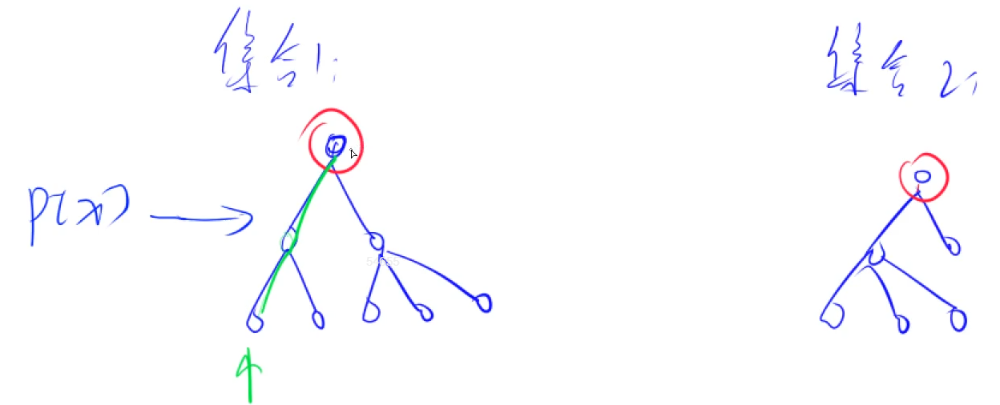
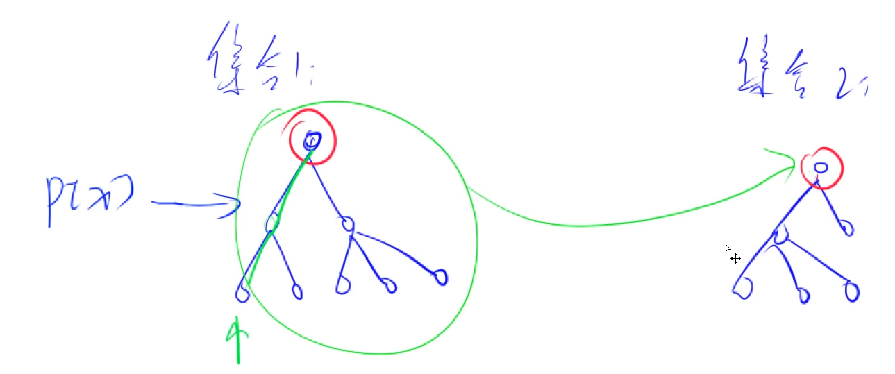

# :book: 并查集结构理解与实现

## :bookmark_tabs: 并查集用于解决的问题

> **快速解决问题**

- 将两个集合合并
- 询问两个元素是否存在一个集合当中

**并查集可以近乎 O(1) 的时间复杂度维护上述两个操作**

**:bookmark_tabs: 朴素解法**

**利用一个数组belong[]来进行存储元素x 属于哪一个集合**

```txt
belong[x] = a;
if(belong[x] == belong[y]) 则说明二者在同一个集合当中
```

**:bookmark: 思想理解：**

- **每一个集合我们用一棵树的形式来维护集合**

- **每个节点的根节点的值作为集合的编号**
- **其中每个节点需要记录其父节点是谁，p[x] 表示x的父节点，如果其父节点不是根节点则继续找父节点，直至找到父节点即可确定其所在集合的编号**



:bookmark: **问题一：如何判断树根？**

`if (p[x] == x) ` 则可以证明其是树的根节点，同时也知道当前树是作为编号为`x`的集合。

:bookmark: **问题二：如何求取 x 的集合编号？**

```java
while (p[x] != x){
    x = p[x];
}
```

:bookmark: **问题三：如何合并两个集合？**



`p[x]` 是 x 的集合编号 , `p[y]` 是 y 的集合编号。`p[x] = y` 即可合并两个集合。

## :bookmark_tabs: 针对于 问题二 的优化

- 如果每个节点都需要求取其集合编号，该操作的`时间复杂度与树的高度成正比`，这显然不是一个很好地方案，所以针对于此，我们`需要对其进行优化`。

所以这里我们就要用到 **📖 路径压缩** 的优化方案了：

我们只需要`计算一个叶子节点`其找到根节点,也就是集合编号时，**即可将该叶子节点到根节点的所有路径节点全部修改为直接指向根节点作为父节点，这就是路径压缩。**


## :bookmark_tabs: **代码实现**

:bookmark_tabs: **Y总模板：**

```java
import java.io.*;
import java.util.*;

class Main{
    static int N = 100010;
    static int[] p ;
    static void init(){
        p = new int[N];
    }
    // int find(int x) 是返回元素x所在集合的编号 + 路径压缩
    static int find(int x){
        if(p[x] != x)p[x] = find(p[x]);
        return p[x];
    }
    
}
```


[836. 合并集合 - AcWing题库](https://www.acwing.com/problem/content/838/)

```java
class Main{
    static int N = 100010;
    static int[] p ;
    static void init(){
        p = new int[N];
    }
    // int find(int x) 是返回元素x所在集合的编号 + 路径压缩
    static int find(int x){
        if(p[x] != x)p[x] = find(p[x]);
        return p[x];
    }
    public static void main(String[] args )throws IOException{
        init();
        InputStreamReader in = new InputStreamReader(System.in);
        BufferedReader br = new BufferedReader(in);
        String[] params = br.readLine().split(" ");
        int n = Integer.parseInt(params[0]);
        int m = Integer.parseInt(params[1]);
        for (int i = 1; i <= n;i++){
            p[i] = i;
        }
        while (m -- >0){
            String[] params1 = br.readLine().split(" ");
            String operate = params1[0];
            int a = Integer.parseInt(params1[1]);
            int b = Integer.parseInt(params1[2]);
            if (operate.equals("M")){
                p[find(a)] = find(b);
            }else {
                if (find(a) == find(b)){
                    System.out.println("Yes");
                }else {
                    System.out.println("No");
                }
            }
        }
    }
}
```

## :bookmark_tabs: 并查集 的变形一

> **需要计算连通块的数量，需要计算每个编号集合的数量**

- 这里只需要维护一个 `size[]` 数组即可，在合并过程之前进行`size[find(b)] += size[find(a)]` 操作，之后再进行合并，`p[find(a)] = find(b)`

[837. 连通块中点的数量 - AcWing题库](https://www.acwing.com/problem/content/839/)

```java
import java.io.*;
import java.util.*;

class Main{
    static int N =  100010;
    static int[] p , size;
    static void init (){
        p = new int[N];
        size = new int[N];
    }
    
    static int find(int x){
        if (p[x] != x)p[x] = find(p[x]);
        return p[x];
    }
    
    public static void main(String[] args )throws IOException{
        init();
        InputStreamReader in = new InputStreamReader(System.in);
        BufferedReader br = new BufferedReader(in);
        String[] params = br.readLine().split(" ");
        int n = Integer.parseInt(params[0]);
        int m = Integer.parseInt(params[1]);
        for (int i = 1; i <= n;i++){
            p[i] = i ;
            size[i] = 1;
        }
        while (m -- > 0){
            String[] params1 = br.readLine().split(" ");
            String operate = params1[0];
            if (operate.equals("C")){
                int a = Integer.parseInt(params1[1]);
                int b = Integer.parseInt(params1[2]);
                if (find(a) == find(b) ) continue;
                size[find(b)] += size[find(a)];
                p[find(a)] = find(b);
            }else if (operate.equals("Q1")){
                int a = Integer.parseInt(params1[1]);
                int b = Integer.parseInt(params1[2]);
                if (find(a) == find(b))
                    System.out.println("Yes");
                else 
                    System.out.println("No");
            }else {
                int a = Integer.parseInt(params1[1]);
                System.out.println(size[find(a)]);
            }
        }
        
    }
}
```

