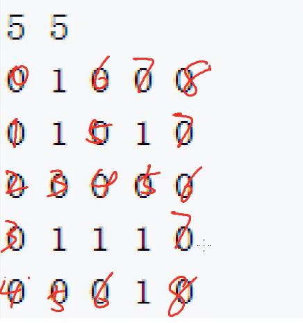

# 📖 BFS 宽度优先搜索的思路理解

## :bookmark_tabs: 思路理解

> **理解 BFS 的思路**

:books: 简单来说,宽度优先搜索，是针对点向外不断扩散的一种思维方式，层层扩散，直到找到所需结果。

**:books: 以题为例**

[844. 走迷宫 - AcWing题库](https://www.acwing.com/problem/content/846/)



**如上图所示，我们可以 通过从左上点为起点 作为需要进行扩散的初始点加入到队列 dq 中，当我们需要进行扩散的时候，我们先从队列中取出该点，进行该点的上下左右进行扩散，符合扩散要求的点就进行扩散，并且加入到队列中，示意为该点会作为扩散源点，在下次扩散时重复上述的情况继续进行扩散。**

> **所以针对 BFS 走迷宫问题而言**

当 **为 0 的点作为扩散源点时**，**周围为 1 的障碍点 不能扩散**，会被阻挡 所以**对于扩散到的值为 1 的点直接进行 continue 不进行扩散**。因为本题是要记录扩散到右下点的最短路，所以也是需要一个 `d[i][j]` 用于记录从左上点到达 点`(i,j)`的最短路。 记录`d[i][j]` 的前提是 之前该点 没有被记录过，否则它就不是最短路了。这是需要注意的。故如果之前记录过`d[i][j]`那么跳过该点就好了。

> **综上思路 伪代码模板**

```java
// 需要一个队列 q
Deque q ;
// 需要开一个二维数组 d[i][j] 用于记录从左上角(0,0)到(i,j)的最短路
int[][] d ;
// 也需要规定一个二维数组directions[][]用于记录每个源点扩散的方向
int[][] directions = {{1,0},{-1,0},{0,1},{0,-1}}
// 如果需要记录扩散最短路的路径就需要额外开一个 Pair[][]
// Pair[i][j] 用于记录最短路到达 (i,j) 这个点是由哪个点扩散而来的
Pair[][] prev ;
```

> **直接套模板**

**:books:总结的模板：**

```java
import java.io.BufferedReader;
import java.io.IOException;
import java.io.InputStreamReader;
import java.util.ArrayDeque;
import java.util.Deque;

/***
 * @author： Alascanfu
 * @date ： Created in 2022/5/16 13:11
 * @description： BFSTemplate 走迷宫例题
 * @modified By： Alascanfu
 **/
class Pair{
    int x ;
    int y ;
    Pair(int x , int y){
        this.x = x ;
        this.y = y ;
    }
}

class Main {
    static Deque<int[]> dq ;
    static int[][] map ;
    static int[][] d ;
    static Pair[][] prev ;
    static int[][] directions ;
    static int n , m;
    static void init(int n , int m){
        dq = new ArrayDeque<>();
        map = new int[n][m];
        d = new int[n][m];
        prev = new Pair[n][m];
        directions = new int[][] {{1,0},{-1,0},{0,1},{0,-1}};
    }
    
    static int bfs (){
        while (!dq.isEmpty()){
            int[] point = dq.poll();
            int x = point[0];
            int y = point[1];
            for (int[] dir : directions){
                int newX = x + dir[0];
                int newY = y + dir[1];
                if (newX < 0 || newY < 0 || newX >= n || newY >= m ||
                    map[newX][newY] != 0 || d[newX][newY] != 0){
                    continue;
                }
                d[newX][newY] = d[x][y] + 1;
                dq.offer(new int[]{newX , newY});
                prev[newX][newY] = new Pair(x , y);
            }
        }
        int x = n - 1, y = m - 1;
        while (x != 0 || y != 0) {
            System.out.println(x + " " + y);
            Pair tmp = prev[x][y];
            x = tmp.x;
            y = tmp.y;
        }
        return d[n-1][m-1];
    }
    
    public static void main(String[] args) throws IOException {
        InputStreamReader in = new InputStreamReader(System.in);
        BufferedReader br = new BufferedReader(in);
        String[] params = br.readLine().split(" ");
        n = Integer.parseInt(params[0]);
        m = Integer.parseInt(params[1]);
        init(n,m);
        for (int i = 0 ; i < n ; i++){
            params = br.readLine().split(" ");
            for (int j = 0 ; j < m ; j++){
                map[i][j] = Integer.parseInt(params[j]);
            }
        }
        dq.offer(new int[]{0,0});
        
        System.out.println(bfs());
    }
}
```

**如果需要记录路径就需要采用 将走到当前点的上一个点进行记录，可以输出所走路径。**

## :bookmark_tabs: 八数码问题解决(BFS + 队列状态存储)

[845. 八数码 - AcWing题库](https://www.acwing.com/problem/content/description/847/)

> **针对于八数码这道问题而言**

此时的队列就是作为状态进行存储了，存储的是每个时刻的状态，同时也需要通过map 来记录由 start 转换为当前状态的最小改变次数 , 直至找到 end 状态结束查找 返回查找结果，如果无法转换则返回 -1。

> **需要注意的点：**

需要注意的就是 在 Java 中String中的字符是无法改变的，这也就导致了我们必须先将当前状态 curState 的字符串转换为字符数组 ，对字符数组中的 x所在位置与新扩散的位置进行交换操作，然后新构造一个由交换过后的字符数组所组成的字符串对象，添加到状态队列中，若该状态没有记录则更新到此新状态所需要的最小转换次数。

```java
import java.io.*;
import java.util.* ;

class Main{
    static Deque<String> dq ;
    static Map<String , Integer> map ;
    static int[][] directions ;
    
    
    static void init(){
        dq = new ArrayDeque<>();
        map = new HashMap<>();
        directions = new int[][]{{1,0},{-1,0},{0,1},{0,-1}};
    }
    
    static void swap(char[] c , int i , int j){
        char tmp = c[i];
        c[i] = c[j];
        c[j] = tmp;
    }
    
    static int bfs (String start ,String end){
        while (!dq.isEmpty()){
            String state = dq.poll();
            if (state.equals(end)) return map.get(state);
            int idx = state.indexOf('x');
            int x = idx / 3 , y = idx % 3;
            for (int[] dir : directions){
                int newX = x + dir[0];
                int newY = y + dir[1];
                if (newX < 0 || newY < 0 || newX >= 3 || newY >= 3)continue;
                char[] c = state.toCharArray();
                swap(c,idx, 3 * newX + newY);
                String curState = new String(c);
                
                if (map.get(curState) == null){
                    dq.offer(curState);
                    map.put(curState,map.get(state)+1);
                }
            }
        }
        return -1;
    }
    
    public static void main(String[] args )throws IOException{
        InputStreamReader in = new InputStreamReader(System.in);
        BufferedReader br = new BufferedReader(in);
        init();
        String start = "";
        String[] params = br.readLine().split(" ");
        for (int i = 0 ; i < params.length ; i++){
            start += params[i];
        }
        String end="12345678x";
        dq.offer(start);
        map.put(start,0);
        System.out.println(bfs(start,end));
    }
}
```

