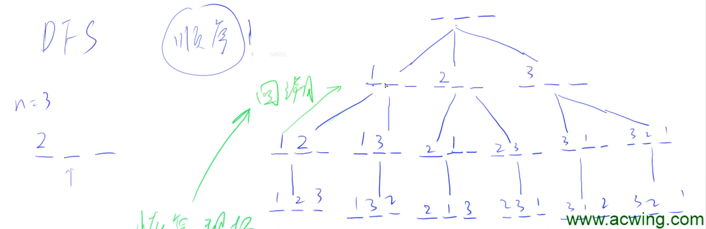
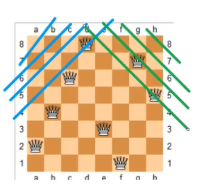
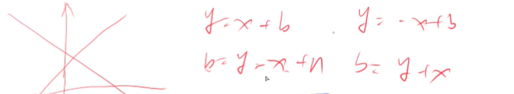

# :bookmark:DFS回溯与剪枝的理解—入门

## :bookmark_tabs: 全排列问题 理解回溯

> [AcWing 842. 排列数字 ](https://www.acwing.com/problem/content/844/)



**以求 n = 3 时的数字全排列为例**

DFS核心理念就是一路到底，坚持不懈，学完回溯，再次深入。

`1`、对于第一个位置可以填写的情况分为三种，我们直接取第一种 1 进行`填入深入`

`2`、对于第二个位置我们`可以填写的位置是不包含已经填写过的数字` 进行填入，这里直接枚举填入 2 

`3`、只剩下最后一个位置最后一个数字 直接进行填入，`填入之后进行回溯 查看是否还能填写`。

`4`、经过`一次回溯之后发现没有可以进行填写的情况了就再次进行回溯`

`5`、回溯之后再次填写第二位除去已经填写的第二位为 2 的情况之下还有第三种情况 第二位填 3，然后继续深入。

`6`、深入后发现结果查询完毕之后，重复操作进行回溯。

**这就是基本的回溯思想 那我们该如何使用DFS来完成的我们的回溯操作。**

```java
class Main{
    static int N = 10;
    static int[] path = new int [N] ;
    static boolean isPermutation[] = new boolean[N];
    // 递归
    public static void dfs(int u ,int n){
        // 递归出口，当我们排列了n个数字的时候就可以输出结果了
        if (u == n){
            for (int i = 0 ; i< n;i++){
                System.out.print(path[i] + " ");
            }
            System.out.println();
            return ;
        }
        // 枚举每种没有使用过的排列数字
        for (int i = 1 ;i <=n;i++){
            // 如果没有被用过
            if (!isPermutation[i]){
                // 当前结果设置
                path[u] = i;
                // 该数字被用过了
                isPermutation[i] = true;
                // dfs深搜递归下一个位置可以填的数字
                dfs(u+1,n);
                // 回溯
                isPermutation[i] = false;
            }
        }
    }
    public static void main(String [] args )throws IOException{
        InputStreamReader in = new InputStreamReader(System.in);
        BufferedReader br = new BufferedReader(in);
        int n = Integer.parseInt(br.readLine());
        dfs(0,n);
    }
}
```

## :bookmark_tabs: N - 皇后问题 理解剪枝



这里需要开三个`boolean`数组：

- `col[N]` 代表的是第 N 列是否放置了皇后
- `dg[N]` 代表的是第N条正对角线上是否放置了皇后
- `udg[N]` 代表的是第N条反对角线上是否放置了皇后



`dg[i+j]` 与 `udg[j-i+n]`

### :bookmark: 方式一：按行回溯

[843. n-皇后问题 - AcWing题库](https://www.acwing.com/problem/content/845/)

**:books:Y 总模板：**

```java
import java.io.*;
import java.util.*;

class Main{
    static char[][] cs ;
    static boolean[] col , dg ,udg;
    
    static void init(int n){
        cs = new char[n][n];
        col = new boolean[n];
        dg =  new boolean[2 * n];
        udg = new boolean[2 * n];
        for (int i = 0 ; i < n ;i++){
            for (int j = 0 ; j < n ; j ++){
                cs[i][j] = '.';
            }
        }
    }
    
    static void dfs(int n , int i){
        if (i == n){
            for (int k = 0 ; k < n;k++){
                System.out.println(cs[k]);
            }
            System.out.println();
            return ;
        }
        
        for (int j = 0 ; j < n ; j++){
            if (!col[j] && !dg[i + j] && !udg[j - i + n] ){
                col[j] = dg[i+j] = udg[j - i + n] = true;
                cs[i][j] = 'Q';
                dfs(n,i+1);
                col[j] = dg[i+j] = udg[j- i + n] = false;
                cs[i][j] = '.';
            }
        }
    }
    public static void main(String[] args )throws IOException{
        InputStreamReader in = new InputStreamReader(System.in);
        BufferedReader br = new BufferedReader(in);
        int n = Integer.parseInt(br.readLine());
        init(n);
        dfs(n,0);
    }
}
```

#### [51. N 皇后](https://leetcode.cn/problems/n-queens/)

```java
class Solution {
    List<List<String>> res = new ArrayList<>();
    boolean[] col , dg ,udg;
    char[][] cs;
    public List<List<String>> solveNQueens(int n) {
        cs = new char[n][n];
        col = new boolean[n];
        dg =  new boolean[2 * n];
        udg = new boolean[2 * n];
        for (int i = 0 ; i < n ; i++){
            for (int j = 0 ; j < n ; j++){
                cs[i][j] = '.';
            }
        }
        dfs(n,0);
        return res;
    }

    void dfs (int n , int i){
        if (i == n){
            List<String> tmp1 = new ArrayList<>();
            for (int k = 0 ; k < n ;k++){
                String tmp2 = new String(cs[k]);
                tmp1.add(tmp2);
            }
            res.add(tmp1);
            return ;
        }

        for (int j = 0 ; j < n ; j++ ){
            if (!col[j] && !dg[i+j] && !udg[j - i + n]){
                col[j] = dg[i+j] = udg[j - i + n] = true;
                cs[i][j] = 'Q';
                dfs(n , i+ 1);
                cs[i][j] = '.';
                col[j] = dg[i+j] = udg[j - i + n] = false;
            }
        }
    }
}
```

#### [52. N皇后 II](https://leetcode.cn/problems/n-queens-ii/)

```java
class Solution {
    int cnt = 0 ;
    boolean[] col , dg ,udg;
    void init(int n ){
        col = new boolean[n];
        dg = new boolean[2 * n];
        udg = new boolean[2 * n];
    }
    void dfs (int n , int i){
        if (i == n ){
            cnt ++;
        }
        for (int j = 0 ; j < n ; j++){
            if (!col[j] && !dg[i + j] && !udg[j - i + n]){
                col[j] = dg[i + j] = udg[j - i + n] = true;
                dfs(n , i+1);
                col[j] = dg[i + j] = udg[j - i + n] = false;
            }
        }
    }
    public int totalNQueens(int n) {
        init(n);
        dfs (n , 0);
        return cnt;
    }
}
```

### :bookmark: 方式二：枚举回溯

[843. n-皇后问题 - AcWing题库](https://www.acwing.com/problem/content/845/)

**:book: Y 总模板：**

**枚举每个格子~**

```java
import java.io.*;
import java.util.*;

class Main{
    static char[][] cs;
    static boolean[] col , row , dg , udg ;
    
    static void init(int n ){
        cs = new char[n][n];
        col = new boolean[n];
        row = new boolean[n];
        dg  = new boolean[2 * n];
        udg = new boolean[2 * n];
        for (int i = 0 ; i < n ; i++){
            for (int j = 0 ; j < n ; j++){
                cs[i][j] = '.';
            }
        }
    }
    
    static void dfs (int i , int j , int n ,int queenNum){
        if (j == n){
            j = 0 ;
            i ++;
        }
        if (i == n){
            if (queenNum == n){
                for (int k = 0 ; k < n ; k++){
                    System.out.println(cs[k]);
                }
                System.out.println();
            }
            return ;
        }
        
        dfs(i,j+1,n,queenNum);
        
        if (!row[i] && !col[j] && !dg[i + j] && !udg[j - i + n]){
            row[i] = col[j] = dg[i + j] = udg [j - i + n] = true;
            cs[i][j] = 'Q';
            dfs(i,j + 1,n,queenNum + 1);
            cs[i][j] = '.';
            row[i] = col[j] = dg[i + j] = udg [j - i + n] = false;
        }
        
    }
    
    public static void main(String[] args )throws IOException{
        InputStreamReader in = new InputStreamReader(System.in);
        BufferedReader br = new BufferedReader(in);
        int n = Integer.parseInt(br.readLine());
        int queenNum = 0;
        init(n);
        dfs(0,0,n,0);
    }
}
```

