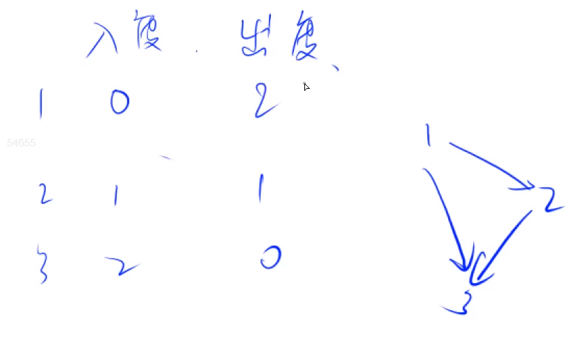

# :book: 拓扑排序

## :bookmark_tabs: 思路理解

> 图片与解题思路摘录自 [Hasity- AcWing](https://www.acwing.com/user/myspace/index/55289/) 如果可以一定要给原作者点个 👍 哦~

**什么是拓扑排序?**

- 一个有向图，如果图中有入度为 0 的点，就把这个点删掉，同时也删掉这个点所连的边。

- 一直进行上面出处理，如果所有点都能被删掉，则这个图可以进行拓扑排序。

举例子


开始时，图是这样的状态，发现`A`的**入度为 0**，所以**删除A和A上所连的边**，结果如下图：


这时发现`B`的**入度为 0**，`C`的**入度为 0**，所以**删除B和B上所连的边、C和C上所连的边**，结果如下图：


这时发现发现`D的入度为 0`，所以删除`D`和`D`上所连的边(**如果有就删**)，结果如下图：


这时整个图被删除干净，所有能进行拓扑排序。

> **拓扑排序是针对有向图的**

> **所有的边 都是 从前指向后的**

> **如果有自闭环 那一定不可能存在拓扑排序**

**:books: 可以证明的是，有向无环图 一定是存在一个拓扑序列的 ， 所以有向无环图 也被称之为 拓扑图。**

**入度 与 出度 的概念理解：**



> **入度为 0 的点，说明 不会有 任何点 指向该点，说明其可以排在前面，此时 将所有入度为 0 的点入队。**

> **然后就是一个 宽度搜索（BFS）的过程**

```java
Deque dq ;
d[j] 表示 j 的入度;
while (!dq.isEmpty()){
   	var t = dq.poll();
    枚举 t 的所有出边 t - > j :
    	删掉 t - j , d[j]--;
    	if d[j] = 0 ;说明此时 j 没有任何限制了就可以放在最前面了
        dq.offer(j);
}
```

`一个 有向无环图 一定存在一个入度为 0 的点。`

## :bookmark_tabs: Y总思路解题

[848. 有向图的拓扑序列 - AcWing题库](https://www.acwing.com/problem/content/description/850/)

```java
import java.io.BufferedReader;
import java.io.IOException;
import java.io.InputStreamReader;
import java.util.ArrayDeque;
import java.util.Arrays;
import java.util.Deque;

/***
 * @author： Alascanfu
 * @date ： Created in 2022/5/18 21:43
 * @description： TopologicalSort 拓扑排序 解决有向图的拓扑序列
 * @modified By： Alascanfu
 **/
class Main {
    static int N = 100010;
    static int M = 2 * N ;
    // 邻接表 记录
    static int[] h , e , ne ;
    static int idx ;
    // 队列
    static Deque<Integer> dq ;
    // d[i] 用于记录i点 的入度
    static int[] d ;
    
    static int cnt ;
    static int[] top ;
    
    static void init(){
        idx = 0 ;
        h = new int[N];
        e = new int[M];
        ne = new int[M];
        d = new int[N];
        cnt = 0 ;
        dq = new ArrayDeque<>();
        top = new int[N];
        Arrays.fill(h,-1);
    }
    
    // 建 边
    static void add(int a , int b){
        e[idx] = b;
        ne[idx] = h[a];
        h[a] = idx ++;
    }
    
    static boolean topologicalSort(int n ){
        while (!dq.isEmpty()){
            int u = dq.poll();
            for (int i = h[u] ; i != -1 ; i = ne[i]){
                int j = e[i];
                d[j] --;
                if (d[j] == 0){
                    dq.offer(j);
                    top[cnt ++] = j;
                }
            }
        }
        return cnt == n;
    }
    
    public static void main(String[] args) throws IOException {
        InputStreamReader in = new InputStreamReader(System.in);
        BufferedReader br = new BufferedReader(in);
        init();
        args = br.readLine().split(" ");
        int n = Integer.parseInt(args[0]);
        int m = Integer.parseInt(args[1]);
        while (m-- > 0){
            args = br.readLine().split(" ");
            int x = Integer.parseInt(args[0]);
            int y = Integer.parseInt(args[1]);
            add(x,y);
            d[y] ++ ;
        }
        
        for (int i = 1 ; i <= n ; i++){
            if (d[i] == 0){
                dq.offer(i);
                top[cnt++] = i;
            }
        }
        
        if (topologicalSort(n)){
            for (int i = 0 ; i< n ; i++){
                System.out.print(top[i] + " ");
            }
        }else {
            System.out.print(-1);
        }
    }
}
```

