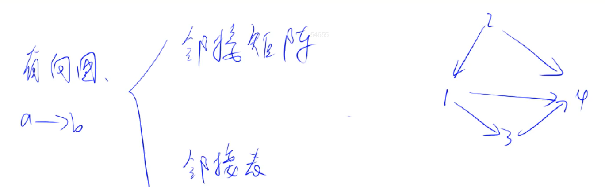
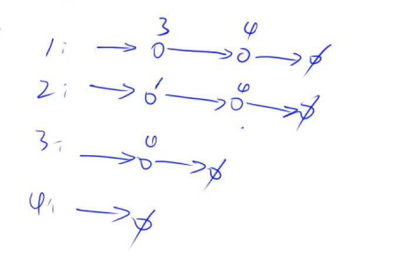

# :bookmark: 邻接表存图学习——扩展存图的方式、树的父子节点存储方式

## :bookmark_tabs: **三种「存图」方式 —— 三叶姐姐的思路哦~**

> 原文链接：:baby_chick: [涵盖所有的《存图方式》模板](https://mp.weixin.qq.com/s?__biz=MzU4NDE3MTEyMA==&mid=2247488007&idx=1&sn=9d0dcfdf475168d26a5a4bd6fcd3505d&chksm=fd9cb918caeb300e1c8844583db5c5318a89e60d8d552747ff8c2256910d32acd9013c93058f&mpshare=1&scene=23&srcid=0311tjKy74JijYzXhHo8Qob7&sharer_sharetime=1646964421353&sharer_shareid=1221771780968b30ef07c3f22cd356ed%23rd)

### 第一种方式：:open_book: 邻接矩阵

> 最佳适用的情况

适用边数较多的` [稠密图]` 使用，这里以`m ` 代表边的个数 ，以 `n` 代表节点的个数 ，当  $m \approx n^2$ 时，可定义为`[稠密图]`。

**当我们想要表示 从节点a 到 结点b 所需要花费的权重c的边就可以用这个二维矩阵来表示：**

```java
// 邻接矩阵数组：w[a][b] = c 代表从 a 到 b 有权重为 c 的边
int[][] w = new int[N][N];

// 加边操作
void add(int a, int b, int c) {
    w[a][b] = c;
}
```

- `w[a][b]`：表示的是当前从a到b这条边所需要的权重值。

### 第二种方式：:open_book: 邻接表

> 最佳适用的情况

这是一种比较常见的存图方式，与数组存储单链表的实现方式一致。 可以去实现用数组存储单链表实现一下再来学习这个。

> [Acwing 826. 单链表](https://www.acwing.com/problem/content/828/)

```java
class Main{
    static int N = 100010;
    static int head ,idx;
    static int[] e = new int [N],ne = new int[N];
    
    public static void init(){
        head = -1;
        idx = 0;
    }
    
    public static void add2Head(int val){
        e[idx] = val;
        ne[idx] = head;
        head = idx++;
    }
    
    public static void add(int k ,int val){
        e[idx] = val;
        ne[idx] = ne[k];
        ne[k] = idx++;
    }
    
    public static void remove(int k){
        ne[k] = ne[ne[k]];
    }
}
```

大致思路就是如上述所示。

- `idx`代表的是节点编号
- `e[]`指代的是编号位置上的值
- `ne[]`代表的是当前编号位置指向的下一个节点的位置
- `head`代表的是头指针位置

**有了上述基础就简单了，我们来接着看下邻接表存图。**

这种存图方式被三叶姐姐称作【链式前向星存图】。

> 最佳适用的情况

适用边数较少的` [稀疏图]` 使用，这里以`m ` 代表边的个数 ，以 `n` 代表节点的个数 ，当  $m \approx n$ 时，可定义为`[稀疏图]`。

```java
int[] he = new int[N], e = new int[M], ne = new int[M], w = new int[M];
int idx;

void add(int a, int b, int c) {
    e[idx] = b;
    ne[idx] = he[a];
    he[a] = idx;
    w[idx] = c;
    idx++;
}
```

**这里需要深刻理解每个数组存储的到底是什么？**

- `idx` 代表的是对每条边进行编号
- `e[]`代表的是当前边访问的点
- `he[]` 数组我们可以理解为是一个 `head[]`数组，用来存储的是每个节点所对应边集合的头结点
- `ne[]`代表的当前节点找到下一条边的位置
- `w[]`：用于记录某条边的权重为多少。

因此当我们想要遍历所有由 `a` 点发出的边时，可以使用如下方式：

```java
for (int i = he[a]; i != -1; i = ne[i]) {
    int b = e[i], c = w[i]; // 存在由 a 指向 b 的边，权重为 c
}
```

> 扩展学习二叉树的父子节点对应邻接表的存储方式

```java
static int N = 100010, M = N * 2;// 二叉树边的个数为2N
static int[] he = new int[N], e = new int[M], ne = new int[M];
static int[] f = new int[N];
int idx;

void add(int a, int b) {
    e[idx] = b;
    ne[idx] = he[a];
    he[a] = idx++;
}
```


## :bookmark_tabs:树与图的存储 方式 —— Y总思路

> **树是一种特殊的图——树是无环连通图**

>  **有向图 ** a- > b

>  **无向图** a - b  a-> b b - > a



### 第一种方式：:open_book: 邻接矩阵

### 第二种方式：:open_book: 邻接表



```java
int N = 100010;
int M = 2 * N ;
int[] e , ne , h ;
int idx;
boolean[] isVisited ;

void init(){
    e = new int[N];
    ne = new int[M];
    h = new int[M];
    isVisited = new boolean[N];
    Arrays.fill(h,-1);
}
void add(int a . int b){
    e[idx] = b;
    ne[idx] = h[a];
    h[a] = idx ++;
}

// 深度优先搜索代码
void dfs (int u){
    isVisited[u] = true;
    for (int i = h[u] ; i != -1 ; i = ne[i]){
        int j = e[i];
        if (!isVisited(j)){
            dfs(j);
        }
    }
}
```

[846. 树的重心 - AcWing题库](https://www.acwing.com/problem/content/848/)

> **解题思路**

树的重心。

>  dfs均可将一个连通图中的点遍历完，dfs使用更简洁，一般无特殊要求可用dfs

>  每次dfs时，返回dfs的结点的子树大小sum，故对于每个儿子返回的sum值，当前结点做以下处理：

>  比较各个子树的sum选择一个最大值；此外，除了这个子树后剩余的部分的个数也参与比较

**注意：这是一颗树，故任何一个结点都可以作为主根向下遍历**

```java
import java.io.*;
import java.util.* ;

class Main{
    static int N = 100010 ;
    static int M = 2 * N ;
    static int[] h , e , ne ;
    static int idx ;
    static boolean[] st ;
    static int ans = N ;
    static int n ;
    
    static void init(){
        h = new int[N];
        e = new int[M];
        ne = new int[M];
        st = new boolean[N];
        Arrays.fill(h,-1);
        idx = 0 ;
    }

    static void add(int a, int b ){
        e[idx] = b ;
        ne[idx] = h[a];
        h[a] = idx++;
    }

    // 返回的是 以 u 为节点的子树中节点个数
    static int dfs(int u){
        st[u] = true;
        int sum = 1 ,res = 0;
        for (int i = h[u] ; i != -1 ; i = ne[i]){
            int j = e[i];
            if (!st[j]){
                int s = dfs(j);
                res = Math.max(res , s);
                sum += s;
            }
        }
        res = Math.max(res , n - sum);
        ans = Math.min(ans , res);
        return sum;
    }
    
    public static void main(String[] args )throws IOException{
        init();
        InputStreamReader in = new InputStreamReader(System.in);
        BufferedReader br = new BufferedReader(in);
        n = Integer.parseInt(br.readLine());
        for (int i = 0 ; i < n -1 ; i++){
            String[] params = br.readLine().split(" ");
            int a = Integer.parseInt(params[0]);
            int b = Integer.parseInt(params[1]);
            add(a,b);
            add(b,a);
        }
        dfs(1);
        System.out.print(ans);
    }
}
```

[847. 图中点的层次 - AcWing题库](https://www.acwing.com/problem/content/849/)

```java
import java.io.*;
import java.util.*;

class Main{
    static int N = 100010 ;
    static int[] e ,ne , h ;
    static int[] d ;
    static boolean[] st ;
    static Deque<Integer> dq;
    static int idx , n ;
    static void init(){
        e = new int[N];
        d = new int[N];
        ne = new int[N];
        h = new int[N];
        st = new boolean[N];
        idx = 0 ;
        dq = new ArrayDeque<>();
        Arrays.fill(h,-1);
        Arrays.fill(d,-1);
        d[1] = 0;
    }
    
    static void add(int a , int b ){
        e[idx] = b ;
        ne[idx] = h[a];
        h[a] = idx ++; 
    }
    
    static int  bfs(){
        while (!dq.isEmpty()){
            int u = dq.poll();
            for (int i = h[u] ; i != -1 ; i = ne[i]){
                int j = e[i];
                if (d[j] == -1){
                    d[j] = d[u] + 1;
                    dq.offer(j);
                }
            }
        }
        return d[n];
    }
    
    public static void main(String[] args )throws IOException{
        InputStreamReader in = new InputStreamReader(System.in);
        BufferedReader br = new BufferedReader(in);
        init();
        args = br.readLine().split(" ");
        n = Integer.parseInt(args[0]);
        int m = Integer.parseInt(args[1]);
        
        while (m-- > 0){
            args = br.readLine().split(" ");
            int a = Integer.parseInt(args[0]);
            int b = Integer.parseInt(args[1]);
            add(a,b);            
        }
        
        dq.offer(1);
        System.out.print(bfs());
    }
}
```

