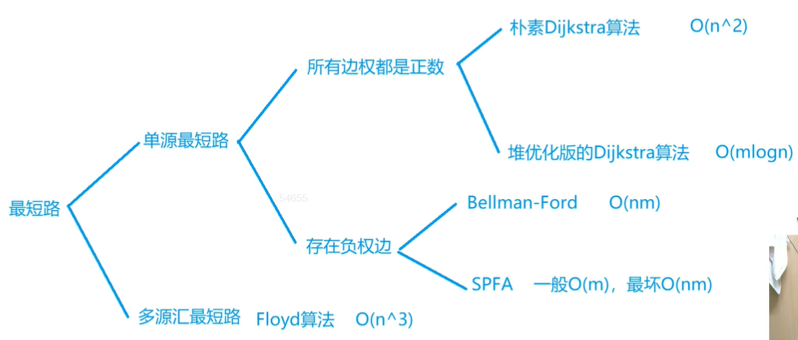
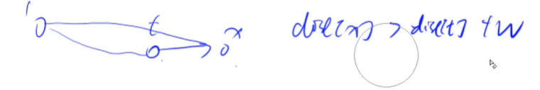

# 📖 最短路算法思想学习

## :bookmark_tabs:常见最短路问题分类



**源点：起点**

**汇点：终点**

### :bookmark: **单源最短路**

> **单源最短路**

**:books:求解的是：从一个点到其它所有点的最短距离**

> **所有边权都是正数 n 表示点的数量 m 表示边的数量**

- 朴素的 Dijkstra 算法 **时间复杂度：$O(n^2)$** —— 稠密图
- 堆优化版 的 Dijkstra 算法 **时间复杂度：$O(mlogn)$** —— 稀疏图

> **存在负权边**

**:books: 注意：如果有不超过 k 条边的最短路用 Bellman-Ford 算法**

- Bellman-Ford **时间复杂度：$O(n m)$** 
- SPFA **时间复杂度：一般：$O( m )$  最坏：$ O(n m)$**  SPFA 实际上是对Bellman-Ford 算法的优化

**:books: 经过不超过 k 条边的最短路是无法使用 SPFA 算法来进行处理的。**

### :bookmark: **多源汇最短路**

> **多源汇最短路**

:books: **求解的是：从其中某一个点走到另外一个点的最短距离**

- Floyd 算法 **时间复杂度：$O(n^3)$** 

## :bookmark_tabs: 最短路考察点

> **最短路算法不会去考察算法原理的正确性**

- **侧重点为 如何将原问题抽象为图 —— 建图**

- **了解实现思路 ， 实现的代码模板**

## :bookmark_tabs: 朴素的 Dijkstra 算法

> **例题**
>
> #### [743. 网络延迟时间](https://leetcode.cn/problems/network-delay-time/)
>
> #### [847. 访问所有节点的最短路径](https://leetcode.cn/problems/shortest-path-visiting-all-nodes/)

> **步骤一：初始化距离 与 初始化是否已具有最短路**

需要开一个 `dist[]` 数组用于记录 到达起点的距离，如 `dist[1] = 0` 表示的是 `1 号点距离起点距离为 0`，其余 **dist[i] =  $+\infty$** 

需要开一个`st[]` boolean 数组 用于记录如果该点 i 已经确定最短路距离

> **步骤二：迭代过程 **



```python
# 伪代码
for i in n :
    t = -1
    for j in n:
        if j not in s & (t == -1 || dist[t] > dist[j])
        	t = j
    j in s
    for j in n:
        dist[j] = min(dist[j],dist[t] + g[t][j])
if dist[n] != nil return dist[n]
else return dist[n]
```

:books: 注意点：因为 $n^2 \approx m$ 所以这是一个稠密图 ，稠密图用邻接矩阵来存储 

[849. Dijkstra求最短路 I - AcWing题库](https://www.acwing.com/problem/content/851/)

```java
import java.io.*;
import java.util.*;

class Main{
    static int n , m;
    static int N = 510 ;
    static int [][] g ;
    static int [] dist ;
    static boolean[] st ;
    static int INFTY = 10010;
    
    static void init(){
        g = new int[N][N];
        dist = new int[N];
        st = new boolean[N];
        Arrays.fill(dist,INFTY);
        for (int i = 1 ; i<= n ; i++){
            Arrays.fill(g[i],INFTY);
        }
        dist[1] = 0;
    }
    
    static int dijkstra(){
        for (int i = 1 ;i<= n ;i++){
            int t = -1 ;
            for (int j = 1 ; j<= n ; j++){
                if (!st[j] && (t == -1 || dist[t] > dist[j])){
                    t = j ;
                }
            }
            st[t] = true ;
            for (int j = 1 ; j <= n ;j++){
                dist[j] = Math.min(dist[j],dist[t] + g[t][j]);
            }
        }
        if (dist[n] == 10010){
            return -1;
        }else{
            return dist[n];
        }
    }
    
    public static void main(String[] args )throws IOException{
        InputStreamReader in = new InputStreamReader(System.in);
        BufferedReader br = new BufferedReader(in);
        args = br.readLine().split(" ");
        n = Integer.parseInt(args[0]);
        m = Integer.parseInt(args[1]);
        init();
        while (m-- > 0){
            args = br.readLine().split(" ");
            int x = Integer.parseInt(args[0]);
            int y = Integer.parseInt(args[1]);
            int z = Integer.parseInt(args[2]);
            if (x == y){
                g[x][y] = 0;
            }else {
                g[x][y] = Math.min(g[x][y] , z);
            }
        }
        System.out.print(dijkstra());
    }
}
```

## :bookmark_tabs: 堆优化（优先队列）的 Dijkstra 算法


> **什么时候采用堆优化版 的 Dijkstra 算法呢？**

如果是稀疏图时 即 $n \approx m$ 时此时用邻接数组来进行存储时 ，内存就会爆掉，所以就需要堆优化。空间优化的同时。

**查看一下算法中，哪个区块计算耗时最长，对其进行优化，我们可以很清楚的发现更新距离时的操作 时间复杂度为 $O(n^2)$ 的故，我们可以用之前学过的堆，用一堆数中找到最小的数。使得其 变为 O(1)**

> **优化的伪代码**

```python
首先我们需要一个优先队列 优先队列是按照 距离进行比较插入的
PriorityQueue<int[]> pq 
a[0] 代表的是哪个点 a[1] 代表的是距离 
排序规则 (a,b)->{return a[1] - b[1];};

while (!pq.isEmpty()){
    int[] cur = pq.poll();
    int t = cur[0] , distance = cur[1];
    if (st[t] )continue;
    st[t] = true ;
    for (int i = h[t] ; i != -1;i = ne[i]){
        int j = e[i];
        if (dist[j] > distance + w[i]){
            dist[j] = distance + w[i];
            pq.offer(new int[]{j , dist[j]});
        }
    }
}
```

[850. Dijkstra求最短路 II - AcWing题库](https://www.acwing.com/problem/content/description/852/)

```java
import java.io.BufferedReader;
import java.io.IOException;
import java.io.InputStream;
import java.io.InputStreamReader;
import java.util.Arrays;
import java.util.PriorityQueue;

/***
 * @author： Alascanfu
 * @date ： Created in 2022/5/22 16:37
 * @description： Dijkstra 堆优化版做法 时间复杂度通常为 O(m*log_n)
 * @modified By： Alascanfu
 **/
class Main {
    static int N = 1000010 ;
    static int M = 2 * N ;
    /** INFTY 的 distance 必须大于 N * 10000 */
    static int INFTY = 0x3f3f3f3f;
    static int n , m ;
    static int[] h , e , ne , w ;
    static int idx ;
    static PriorityQueue<int[]> pq;
    static int[] dist ;
    static boolean[] st ;
    
    static void init(){
        h = new int[N];
        e = new int[M];
        ne = new int[M];
        w = new int[N];
        idx = 0 ;
        Arrays.fill(h,-1);
        pq = new PriorityQueue<>((a,b)->{
            return a[1] - b[1];
        });
        dist = new int[N];
        st = new boolean[N];
    }
    
    static int dijkstra(){
        while (!pq.isEmpty()){
            int[] cur = pq.poll();
            int t = cur[0] ,distance = cur[1];
            if (st[t]){
                continue;
            }
            st[t] = true ;
            for (int i = h[t] ; i != -1 ; i = ne[i]) {3
                int j = e[i];
                if (dist[j] > distance + w[i]) {
                    dist[j] = distance + w[i];
                    pq.offer(new int[]{j, dist[j]});
                }
            }
        }
        return dist[n] == INFTY ? -1 : dist[n];
    }
    
    public static void main(String[] args) throws IOException {
        InputStreamReader in = new InputStreamReader(System.in);
        BufferedReader br = new BufferedReader(in);
        args = br.readLine().split(" ");
        n = Integer.parseInt(args[0]);
        m = Integer.parseInt(args[1]);
        // 因为是一个稀疏图 所以采用邻接表存储
        init();
        while (m -- > 0 ){
            args = br.readLine().split(" ");
            int a = Integer.parseInt(args[0]);
            int b = Integer.parseInt(args[1]);
            int c = Integer.parseInt(args[2]);
            add(a,b,c);
        }
        Arrays.fill(dist,INFTY);
        dist[1] = 0 ;
        pq.offer(new int[]{1, 0 });
        System.out.println(dijkstra());
    }
    
    static void add(int a, int b, int c) {
        e[idx] = b ; w[idx] = c ; ne[idx] = h[a] ; h[a] = idx++;
    }
}
```

